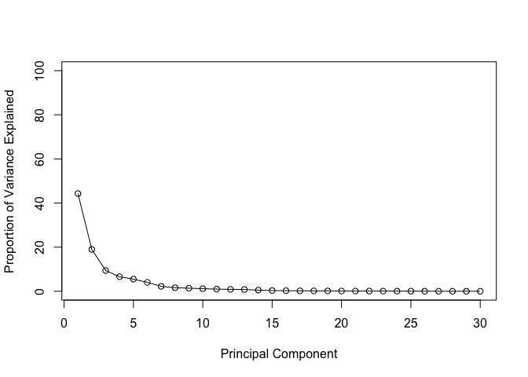
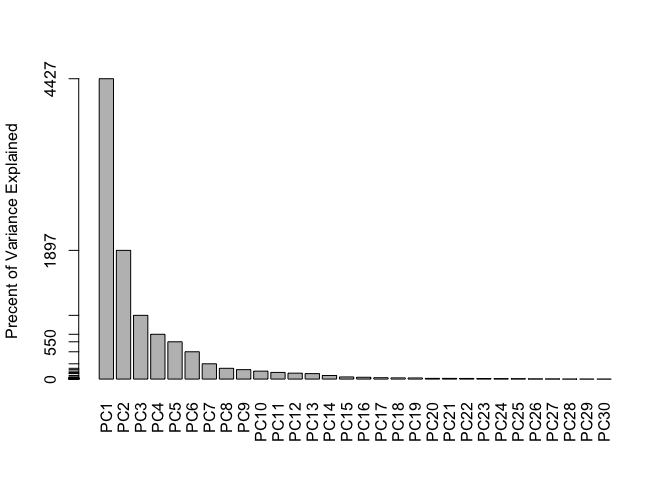
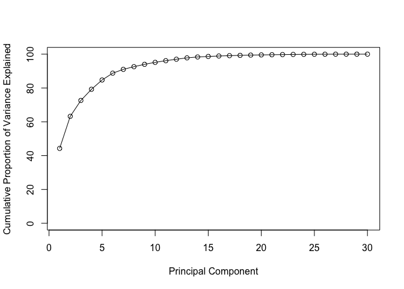
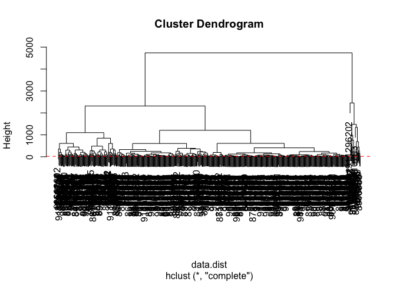
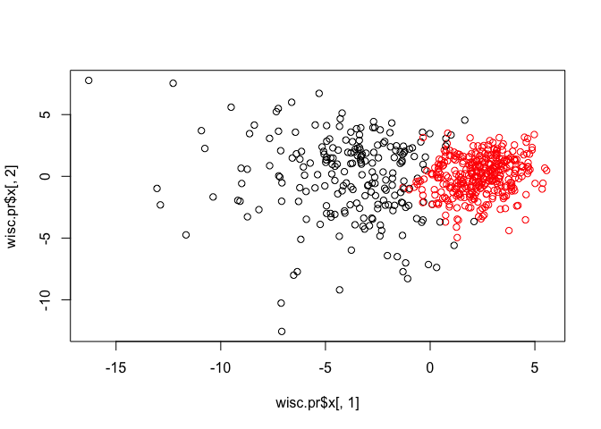
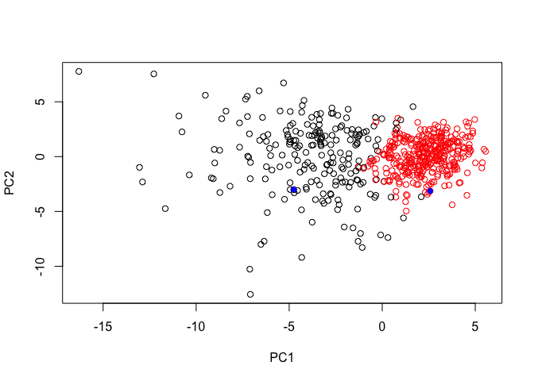

class9
================
Negin Silani
4/30/2019

# Analysis of Human Breast Cancer

``` r
wisc.df<-read.csv("class9.csv")
```

# Convert the features of the data: wisc.data

``` r
wisc.data <- as.matrix( wisc.df[,3:32] )
rownames(wisc.data)<- wisc.df$id
head(wisc.data)
```

    ##          radius_mean texture_mean perimeter_mean area_mean smoothness_mean
    ## 842302         17.99        10.38         122.80    1001.0         0.11840
    ## 842517         20.57        17.77         132.90    1326.0         0.08474
    ## 84300903       19.69        21.25         130.00    1203.0         0.10960
    ## 84348301       11.42        20.38          77.58     386.1         0.14250
    ## 84358402       20.29        14.34         135.10    1297.0         0.10030
    ## 843786         12.45        15.70          82.57     477.1         0.12780
    ##          compactness_mean concavity_mean concave.points_mean symmetry_mean
    ## 842302            0.27760         0.3001             0.14710        0.2419
    ## 842517            0.07864         0.0869             0.07017        0.1812
    ## 84300903          0.15990         0.1974             0.12790        0.2069
    ## 84348301          0.28390         0.2414             0.10520        0.2597
    ## 84358402          0.13280         0.1980             0.10430        0.1809
    ## 843786            0.17000         0.1578             0.08089        0.2087
    ##          fractal_dimension_mean radius_se texture_se perimeter_se area_se
    ## 842302                  0.07871    1.0950     0.9053        8.589  153.40
    ## 842517                  0.05667    0.5435     0.7339        3.398   74.08
    ## 84300903                0.05999    0.7456     0.7869        4.585   94.03
    ## 84348301                0.09744    0.4956     1.1560        3.445   27.23
    ## 84358402                0.05883    0.7572     0.7813        5.438   94.44
    ## 843786                  0.07613    0.3345     0.8902        2.217   27.19
    ##          smoothness_se compactness_se concavity_se concave.points_se
    ## 842302        0.006399        0.04904      0.05373           0.01587
    ## 842517        0.005225        0.01308      0.01860           0.01340
    ## 84300903      0.006150        0.04006      0.03832           0.02058
    ## 84348301      0.009110        0.07458      0.05661           0.01867
    ## 84358402      0.011490        0.02461      0.05688           0.01885
    ## 843786        0.007510        0.03345      0.03672           0.01137
    ##          symmetry_se fractal_dimension_se radius_worst texture_worst
    ## 842302       0.03003             0.006193        25.38         17.33
    ## 842517       0.01389             0.003532        24.99         23.41
    ## 84300903     0.02250             0.004571        23.57         25.53
    ## 84348301     0.05963             0.009208        14.91         26.50
    ## 84358402     0.01756             0.005115        22.54         16.67
    ## 843786       0.02165             0.005082        15.47         23.75
    ##          perimeter_worst area_worst smoothness_worst compactness_worst
    ## 842302            184.60     2019.0           0.1622            0.6656
    ## 842517            158.80     1956.0           0.1238            0.1866
    ## 84300903          152.50     1709.0           0.1444            0.4245
    ## 84348301           98.87      567.7           0.2098            0.8663
    ## 84358402          152.20     1575.0           0.1374            0.2050
    ## 843786            103.40      741.6           0.1791            0.5249
    ##          concavity_worst concave.points_worst symmetry_worst
    ## 842302            0.7119               0.2654         0.4601
    ## 842517            0.2416               0.1860         0.2750
    ## 84300903          0.4504               0.2430         0.3613
    ## 84348301          0.6869               0.2575         0.6638
    ## 84358402          0.4000               0.1625         0.2364
    ## 843786            0.5355               0.1741         0.3985
    ##          fractal_dimension_worst
    ## 842302                   0.11890
    ## 842517                   0.08902
    ## 84300903                 0.08758
    ## 84348301                 0.17300
    ## 84358402                 0.07678
    ## 843786                   0.12440

store diagnosis data as a vector of 1 and 0 values with 1 being

``` r
diagnosis<- as.numeric(wisc.df$diagnosis =="M")
```

> Q.2 how many diagnosis?

``` r
table(wisc.df$diagnosis)
```

    ## 
    ##   B   M 
    ## 357 212

``` r
colnames(wisc.data)
```

    ##  [1] "radius_mean"             "texture_mean"           
    ##  [3] "perimeter_mean"          "area_mean"              
    ##  [5] "smoothness_mean"         "compactness_mean"       
    ##  [7] "concavity_mean"          "concave.points_mean"    
    ##  [9] "symmetry_mean"           "fractal_dimension_mean" 
    ## [11] "radius_se"               "texture_se"             
    ## [13] "perimeter_se"            "area_se"                
    ## [15] "smoothness_se"           "compactness_se"         
    ## [17] "concavity_se"            "concave.points_se"      
    ## [19] "symmetry_se"             "fractal_dimension_se"   
    ## [21] "radius_worst"            "texture_worst"          
    ## [23] "perimeter_worst"         "area_worst"             
    ## [25] "smoothness_worst"        "compactness_worst"      
    ## [27] "concavity_worst"         "concave.points_worst"   
    ## [29] "symmetry_worst"          "fractal_dimension_worst"

> Q1. How many ro names?

``` r
nrow(wisc.data)
```

    ## [1] 569

``` r
dim(wisc.data)
```

    ## [1] 569  30

``` r
length(wisc.data)
```

    ## [1] 17070

Q.3 How many variables/features in the data are suffixed with \_mean?

``` r
length( grep("_mean", colnames(wisc.data)) )
```

    ## [1] 10

``` r
#Colnames(wisc.data)
```

Performing PCA It is important to check if the data need to be scaled
before performing PCA. Recall two common reasons for scaling data
include:

  - The input variables use different units of measurement.
  - The input variables have significantly different variances.

Check the mean and standard deviation of the features (i.e. columns) of
the wisc.data to determine if the data should be scaled. Use the
colMeans() and apply() functions like you’ve done
    before.

# Check column means and standard deviations

``` r
round( colMeans(wisc.data), 1)
```

    ##             radius_mean            texture_mean          perimeter_mean 
    ##                    14.1                    19.3                    92.0 
    ##               area_mean         smoothness_mean        compactness_mean 
    ##                   654.9                     0.1                     0.1 
    ##          concavity_mean     concave.points_mean           symmetry_mean 
    ##                     0.1                     0.0                     0.2 
    ##  fractal_dimension_mean               radius_se              texture_se 
    ##                     0.1                     0.4                     1.2 
    ##            perimeter_se                 area_se           smoothness_se 
    ##                     2.9                    40.3                     0.0 
    ##          compactness_se            concavity_se       concave.points_se 
    ##                     0.0                     0.0                     0.0 
    ##             symmetry_se    fractal_dimension_se            radius_worst 
    ##                     0.0                     0.0                    16.3 
    ##           texture_worst         perimeter_worst              area_worst 
    ##                    25.7                   107.3                   880.6 
    ##        smoothness_worst       compactness_worst         concavity_worst 
    ##                     0.1                     0.3                     0.3 
    ##    concave.points_worst          symmetry_worst fractal_dimension_worst 
    ##                     0.1                     0.3                     0.1

``` r
round( apply(wisc.data,2,sd) )
```

    ##             radius_mean            texture_mean          perimeter_mean 
    ##                       4                       4                      24 
    ##               area_mean         smoothness_mean        compactness_mean 
    ##                     352                       0                       0 
    ##          concavity_mean     concave.points_mean           symmetry_mean 
    ##                       0                       0                       0 
    ##  fractal_dimension_mean               radius_se              texture_se 
    ##                       0                       0                       1 
    ##            perimeter_se                 area_se           smoothness_se 
    ##                       2                      45                       0 
    ##          compactness_se            concavity_se       concave.points_se 
    ##                       0                       0                       0 
    ##             symmetry_se    fractal_dimension_se            radius_worst 
    ##                       0                       0                       5 
    ##           texture_worst         perimeter_worst              area_worst 
    ##                       6                      34                     569 
    ##        smoothness_worst       compactness_worst         concavity_worst 
    ##                       0                       0                       0 
    ##    concave.points_worst          symmetry_worst fractal_dimension_worst 
    ##                       0                       0                       0

# Perform PCA on wisc.data by completing the following code

``` r
wisc.pr <- prcomp( wisc.data, scale=TRUE)
summary(wisc.pr)
```

    ## Importance of components:
    ##                           PC1    PC2     PC3     PC4     PC5     PC6
    ## Standard deviation     3.6444 2.3857 1.67867 1.40735 1.28403 1.09880
    ## Proportion of Variance 0.4427 0.1897 0.09393 0.06602 0.05496 0.04025
    ## Cumulative Proportion  0.4427 0.6324 0.72636 0.79239 0.84734 0.88759
    ##                            PC7     PC8    PC9    PC10   PC11    PC12
    ## Standard deviation     0.82172 0.69037 0.6457 0.59219 0.5421 0.51104
    ## Proportion of Variance 0.02251 0.01589 0.0139 0.01169 0.0098 0.00871
    ## Cumulative Proportion  0.91010 0.92598 0.9399 0.95157 0.9614 0.97007
    ##                           PC13    PC14    PC15    PC16    PC17    PC18
    ## Standard deviation     0.49128 0.39624 0.30681 0.28260 0.24372 0.22939
    ## Proportion of Variance 0.00805 0.00523 0.00314 0.00266 0.00198 0.00175
    ## Cumulative Proportion  0.97812 0.98335 0.98649 0.98915 0.99113 0.99288
    ##                           PC19    PC20   PC21    PC22    PC23   PC24
    ## Standard deviation     0.22244 0.17652 0.1731 0.16565 0.15602 0.1344
    ## Proportion of Variance 0.00165 0.00104 0.0010 0.00091 0.00081 0.0006
    ## Cumulative Proportion  0.99453 0.99557 0.9966 0.99749 0.99830 0.9989
    ##                           PC25    PC26    PC27    PC28    PC29    PC30
    ## Standard deviation     0.12442 0.09043 0.08307 0.03987 0.02736 0.01153
    ## Proportion of Variance 0.00052 0.00027 0.00023 0.00005 0.00002 0.00000
    ## Cumulative Proportion  0.99942 0.99969 0.99992 0.99997 1.00000 1.00000

``` r
diagnosis <-as.numeric(wisc.df$diagnosis== "M")
```

> Q4. From your results, what proportion of the original variance is
> captured by the first principal components (PC1)?

44.2%

``` r
summary(wisc.pr)
```

    ## Importance of components:
    ##                           PC1    PC2     PC3     PC4     PC5     PC6
    ## Standard deviation     3.6444 2.3857 1.67867 1.40735 1.28403 1.09880
    ## Proportion of Variance 0.4427 0.1897 0.09393 0.06602 0.05496 0.04025
    ## Cumulative Proportion  0.4427 0.6324 0.72636 0.79239 0.84734 0.88759
    ##                            PC7     PC8    PC9    PC10   PC11    PC12
    ## Standard deviation     0.82172 0.69037 0.6457 0.59219 0.5421 0.51104
    ## Proportion of Variance 0.02251 0.01589 0.0139 0.01169 0.0098 0.00871
    ## Cumulative Proportion  0.91010 0.92598 0.9399 0.95157 0.9614 0.97007
    ##                           PC13    PC14    PC15    PC16    PC17    PC18
    ## Standard deviation     0.49128 0.39624 0.30681 0.28260 0.24372 0.22939
    ## Proportion of Variance 0.00805 0.00523 0.00314 0.00266 0.00198 0.00175
    ## Cumulative Proportion  0.97812 0.98335 0.98649 0.98915 0.99113 0.99288
    ##                           PC19    PC20   PC21    PC22    PC23   PC24
    ## Standard deviation     0.22244 0.17652 0.1731 0.16565 0.15602 0.1344
    ## Proportion of Variance 0.00165 0.00104 0.0010 0.00091 0.00081 0.0006
    ## Cumulative Proportion  0.99453 0.99557 0.9966 0.99749 0.99830 0.9989
    ##                           PC25    PC26    PC27    PC28    PC29    PC30
    ## Standard deviation     0.12442 0.09043 0.08307 0.03987 0.02736 0.01153
    ## Proportion of Variance 0.00052 0.00027 0.00023 0.00005 0.00002 0.00000
    ## Cumulative Proportion  0.99942 0.99969 0.99992 0.99997 1.00000 1.00000

> Q5. How many principal components (PCs) are required to describe at
> least 70% of the original variance in the data?

3 components, 72.3%

> Q6. How many principal components (PCs) are required to describe at
> least 90% of the original variance in the data?

PC7 (7
PCs)

``` r
plot(wisc.pr$x[,1], wisc.pr$x[,2], col=diagnosis+1, xlab="PC1", ylab="PC2")
```

<!-- -->

> Q7. What stands out to you about this plot? Is it easy or difficult to
> understand? Why?

``` r
biplot(wisc.pr)
```

<!-- -->

> Q8. Generate a similar plot for principal components 1 and 3. What do
> you notice about these
plots?

``` r
plot(wisc.pr$x[,1], wisc.pr$x[,3], col=diagnosis+1, xlab="PC1", ylab="PC3")
```

<!-- -->

Overall, the plots indicate that principal component 1 is capturing a
separation of malignant from benign samples. This is an important and
interesting result worthy of further exploration - as we will do in the
next sections\!

# Calculate variance of each component

``` r
pr.var <-wisc.pr$sdev^2 
head(pr.var)
```

    ## [1] 13.281608  5.691355  2.817949  1.980640  1.648731  1.207357

Calculate the variance explained by each principal component by dividing
by the total variance explained of all principal components. Assign this
to a variable called pve and create a plot of variance explained for
each principal component.

# Variance explained by each principal component: pve

``` r
pve <- (pr.var / sum(pr.var))*100
head(pve)
```

    ## [1] 44.272026 18.971182  9.393163  6.602135  5.495768  4.024522

# Plot variance explained for each principal component

``` r
plot(pve, xlab = "Principal Component", 
     ylab = "Proportion of Variance Explained", 
     ylim = c(0, 100), type = "o")
```

<!-- -->

# Alternative scree plot of the same data, note data driven y-axis

``` r
barplot(pve, ylab = "Precent of Variance Explained",
     names.arg=paste0("PC",1:length(pve)), las=2, axes = FALSE)
axis(2, at=pve, labels=round(pve,2)*100 )
```

<!-- -->

# Plot cumulative proportion of variance explained

``` r
plot(cumsum(pve), xlab = "Principal Component", 
     ylab = "Cumulative Proportion of Variance Explained", 
     ylim = c(0, 100), type = "o")
```

<!-- -->

# Scale the wisc.data data: data.scaled

``` r
data.dist <- dist(wisc.data)
```

``` r
wisc.hclust<- hclust(data.dist, method= "complete")
```

``` r
plot(wisc.hclust)
abline(h=19, col="red", lty=2)
```

<!-- -->

``` r
wisc.hclust.clusters<- cutree(wisc.hclust, k=4)
table(wisc.hclust.clusters, diagnosis)
```

    ##                     diagnosis
    ## wisc.hclust.clusters   0   1
    ##                    1   1 110
    ##                    2 356  82
    ##                    3   0  19
    ##                    4   0   1

``` r
table(wisc.hclust.clusters, diagnosis)
```

    ##                     diagnosis
    ## wisc.hclust.clusters   0   1
    ##                    1   1 110
    ##                    2 356  82
    ##                    3   0  19
    ##                    4   0   1

``` r
grps <- cutree(wisc.hclust, k=2)
table(grps)
```

    ## grps
    ##   1   2 
    ## 549  20

> Q12. Can you find a better cluster vs diagnoses match with by cutting
> into a different number of clusters between 2 and 10?

``` r
grps <- cutree(wisc.hclust, k=10)
table (grps, diagnosis)
```

    ##     diagnosis
    ## grps   0   1
    ##   1    0  17
    ##   2    0  36
    ##   3  260   6
    ##   4   96  76
    ##   5    1  57
    ##   6    0   9
    ##   7    0   7
    ##   8    0   1
    ##   9    0   2
    ##   10   0   1

\#\#Clustering on PCA results

Using the minimum number of principal components required to describe at
least 90% of the variability in the data, create a hierarchical
clustering model with the linkage method=“ward.D2”. We use Ward’s
criterion here because it is based on multidimensional variance like
principal components analysis. Assign the results to wisc.pr.hclust.

``` r
wisc.pca.hclust<- hclust( dist(wisc.pr$x[,1:7]), method=
                           "ward.D2")
plot(wisc.pca.hclust)
```

<!-- -->

``` r
grps<- cutree(wisc.pca.hclust, k=2)
table(grps)
```

    ## grps
    ##   1   2 
    ## 216 353

``` r
table(grps, diagnosis)
```

    ##     diagnosis
    ## grps   0   1
    ##    1  28 188
    ##    2 329  24

``` r
plot(wisc.pr$x[,1], wisc.pr$x[,2], col=grps)
```

<!-- -->

``` r
plot(wisc.pr$x[,1:2], col=diagnosis+1)
```

<!-- -->

``` r
library(rgl)
```

    ## Warning in rgl.init(initValue, onlyNULL): RGL: unable to open X11 display

    ## Warning: 'rgl_init' failed, running with rgl.useNULL = TRUE

``` r
plot3d(wisc.pr$x[,1:3], xlab="PC 1", ylab="PC 2", zlab="PC 3", cex=1.5, size=1, type="s", col=diagnosis+1, rgl.useNULL = TRUE)
rglwidget(width = 400, height = 400)
```

    ## PhantomJS not found. You can install it with webshot::install_phantomjs(). If it is installed, please make sure the phantomjs executable can be found via the PATH variable.

<!--html_preserve-->

<div id="rgl18074" class="rglWebGL html-widget" style="width:400px;height:400px;">

</div>

<script type="application/json" data-for="rgl18074">{"x":{"material":{"color":"#000000","alpha":1,"lit":true,"ambient":"#000000","specular":"#FFFFFF","emission":"#000000","shininess":50,"smooth":true,"front":"filled","back":"filled","size":3,"lwd":1,"fog":false,"point_antialias":false,"line_antialias":false,"texture":null,"textype":"rgb","texmipmap":false,"texminfilter":"linear","texmagfilter":"linear","texenvmap":false,"depth_mask":true,"depth_test":"less","isTransparent":false,"polygon_offset":[0,0]},"rootSubscene":1,"objects":{"7":{"id":7,"type":"spheres","material":{},"vertices":[[-9.18475532531738,-1.94687008857727,-1.12217879295349],[-2.38570261001587,3.76485896110535,-0.528827369213104],[-5.7288556098938,1.07422864437103,-0.551262557506561],[-7.11669111251831,-10.2665557861328,-3.22994756698608],[-3.9318425655365,1.94635891914368,1.38854491710663],[-2.37815451622009,-3.94645643234253,-2.93229675292969],[-2.23691511154175,2.68766641616821,-1.63847124576569],[-2.14141416549683,-2.33818674087524,-0.871180713176727],[-3.17213320732117,-3.38883113861084,-3.11724305152893],[-6.34616279602051,-7.72038078308105,-4.33809852600098],[0.809701323509216,2.65693759918213,-0.488400042057037],[-2.64876985549927,-0.0665094032883644,-1.5251133441925],[-8.1778392791748,-2.69860196113586,5.72519302368164],[-0.341825157403946,0.967428028583527,1.71566200256348],[-4.33856153488159,-4.85680961608887,-2.81363987922668],[-4.07207298278809,-2.9744439125061,-3.1225266456604],[-0.229852765798569,1.56338214874268,-0.801813662052155],[-4.41412687301636,-1.41742312908173,-2.26832318305969],[-4.9443531036377,4.11071634292603,-0.314472407102585],[1.23597586154938,0.188049495220184,-0.592761933803558],[1.57677388191223,-0.572304606437683,-1.79986298084259],[3.55420899391174,-1.66148793697357,0.450790792703629],[-4.72904968261719,-3.30205821990967,-1.46524739265442],[-4.20482444763184,5.1238579750061,-0.751740574836731],[-4.9452805519104,1.54239511489868,-1.71168780326843],[-7.09232234954834,-2.01683568954468,-0.0289841331541538],[-3.50717663764954,-2.16971588134766,-3.89112257957458],[-3.06136012077332,1.87490260601044,2.5794780254364],[-4.00374126434326,-0.536769866943359,-2.75919795036316],[-1.71380174160004,1.52236545085907,0.146058574318886],[-6.05411863327026,0.756511807441711,-0.348932385444641],[-2.89968466758728,-4.00177431106567,-2.99882388114929],[-4.55077838897705,-0.337239414453506,-0.753637671470642],[-4.98621559143066,1.13159322738647,-2.57511830329895],[-2.98271632194519,-0.757756471633911,-3.49069023132324],[-2.76393723487854,0.354044407606125,-1.89529538154602],[-1.29505920410156,-0.912393450737,-1.57438337802887],[3.74601721763611,1.41223049163818,1.73078489303589],[0.997191488742828,3.34834671020508,4.30178880691528],[-0.764591336250305,-0.88546484708786,-2.70254039764404],[2.1490626335144,1.92230021953583,-1.17944633960724],[0.0932493358850479,-2.25876450538635,-1.90305197238922],[-9.08001041412354,-2.01689839363098,2.13934397697449],[-0.989583015441895,-0.984064161777496,-2.30870223045349],[0.293288499116898,0.136978566646576,-3.29902911186218],[-5.37620973587036,0.134758397936821,-1.67736661434174],[4.57790851593018,-1.48291552066803,0.04203762114048],[-1.69851231575012,-2.3502037525177,-3.07538318634033],[2.13456702232361,-0.095745362341404,-1.49109983444214],[1.56610095500946,1.20737087726593,-0.368834584951401],[3.53979086875916,1.28136813640594,1.01731586456299],[3.15503787994385,1.6874737739563,-0.495857417583466],[3.44745516777039,0.497780710458755,-0.152383878827095],[-3.29964756965637,1.12994360923767,0.825666129589081],[0.674026191234589,2.11454916000366,-1.39499235153198],[2.85564565658569,-0.152588874101639,0.428557842969894],[-4.64465188980103,2.30830144882202,-0.728168129920959],[-2.17494916915894,-0.971261441707611,-1.94217944145203],[3.71818733215332,1.7860701084137,1.27880764007568],[4.13232707977295,-2.40167927742004,-1.24186563491821],[2.38373827934265,-2.75523376464844,1.21301829814911],[2.57661604881287,-3.13591265678406,1.39904916286469],[-4.75492811203003,-3.00903296470642,-0.166094571352005],[2.31209778785706,-3.26511669158936,2.79376602172852],[-1.69012081623077,-1.53932213783264,-1.79826295375824],[-1.81071221828461,-0.722104787826538,-1.46496057510376],[2.78347563743591,-2.30861735343933,0.472309708595276],[3.51555490493774,0.657730758190155,0.590855062007904],[-4.32619619369507,-9.19443511962891,1.49165034294128],[3.25841236114502,0.937013626098633,0.204949676990509],[-2.70221853256226,4.43324089050293,0.307075202465057],[0.307585120201111,-7.38131761550903,3.81572842597961],[-5.49886703491211,-0.937500536441803,-2.20818877220154],[0.361391216516495,-0.119633823633194,-2.03916144371033],[2.62766456604004,0.69669634103775,-0.583428263664246],[-1.42691206932068,1.96537208557129,1.11096131801605],[0.833784222602844,-1.96387684345245,0.789737641811371],[-6.22541856765747,-0.919260680675507,0.0897483378648758],[-11.6584568023682,-4.74444246292114,2.00411558151245],[2.01980042457581,0.25467574596405,-0.647302448749542],[1.6369446516037,-1.71444058418274,0.43382453918457],[-1.16643524169922,-2.51230525970459,-1.90404343605042],[-10.7597751617432,2.25599789619446,0.0388016477227211],[-5.03038501739502,-0.773728370666504,2.67998003959656],[2.17255258560181,-0.496441155672073,-0.948257446289062],[-3.28534460067749,1.66677045822144,0.146802678704262],[-0.607073783874512,-0.162071913480759,1.63593542575836],[-3.58041334152222,2.20472192764282,-1.7030371427536],[0.933336853981018,-0.926885902881622,-0.0401283465325832],[-1.25849735736847,-1.01468420028687,-0.0805219933390617],[1.58686769008636,1.61823296546936,0.309726685285568],[-0.252275586128235,0.530884444713593,0.588809728622437],[2.84492826461792,2.89110374450684,0.527524650096893],[1.96322274208069,0.964308500289917,-0.0811367183923721],[-2.77342534065247,-0.557509958744049,-0.605238676071167],[-4.39236307144165,2.12164092063904,0.579000532627106],[2.58980417251587,-0.213446125388145,1.0347011089325],[3.90090584754944,-1.18902039527893,1.55061686038971],[2.815753698349,-0.367560565471649,-1.35024750232697],[-0.615739107131958,-0.638350009918213,-0.199743121862411],[0.432479679584503,1.39082050323486,-0.0826467648148537],[4.55102443695068,-3.52568387985229,-0.215074717998505],[3.44515228271484,1.42337000370026,-0.0886460021138191],[2.11409997940063,-1.84774780273438,-0.556184589862823],[2.68898606300354,-1.41881334781647,0.96829879283905],[-3.21109127998352,-4.04319858551025,-2.71299719810486],[0.748612642288208,-1.796058177948,-0.567866146564484],[3.15622878074646,1.03483891487122,-1.48937368392944],[-13.0446443557739,-0.980650365352631,0.598286271095276],[2.22672057151794,-0.666823923587799,-1.09060072898865],[2.49063944816589,-2.59640169143677,1.66825771331787],[0.103259570896626,-2.27813911437988,2.1077082157135],[-3.58813691139221,-3.92288136482239,2.04520726203918],[1.34776282310486,-3.55309867858887,1.73066842556],[2.50791096687317,-3.24846124649048,-1.68614077568054],[2.04423093795776,-0.304616838693619,-0.533369421958923],[2.09522557258606,-3.6638720035553,3.62900733947754],[-3.10779309272766,-1.56800985336304,-2.61163806915283],[-4.95236778259277,-2.38274955749512,-1.93340587615967],[-0.850266098976135,2.30470752716064,0.566963076591492],[2.96339178085327,-0.3711798787117,-2.06471633911133],[-3.33120203018188,1.32439208030701,0.727373659610748],[-12.8832759857178,-2.31458592414856,6.32313346862793],[0.77006608247757,0.0640528574585915,-1.13341152667999],[2.20057916641235,0.734958529472351,0.266845315694809],[3.14064884185791,1.87575852870941,-0.669779717922211],[0.638318836688995,0.910564839839935,-2.14084053039551],[-1.9174462556839,3.53497195243835,1.25382125377655],[-1.40762984752655,-1.30378222465515,0.640864849090576],[-4.63960886001587,1.48071432113647,-1.16965138912201],[1.875816822052,-1.42197942733765,-1.06987082958221],[-1.43081045150757,1.04868125915527,-1.26090180873871],[-1.35143792629242,1.15312683582306,-1.20872974395752],[0.708491444587708,1.56685364246368,-0.669405102729797],[-2.16950702667236,2.82377600669861,-0.561613321304321],[1.97510242462158,0.419018745422363,-0.380240589380264],[2.59850311279297,0.481911450624466,1.87072670459747],[3.25514316558838,0.417953640222549,-0.691197454929352],[-3.77870154380798,-0.859625220298767,3.66777348518372],[1.99028348922729,-1.32818651199341,1.13424646854401],[5.01060009002686,-0.574194729328156,-0.841697514057159],[-1.34383797645569,1.27365028858185,0.55535489320755],[2.45380973815918,-0.897665441036224,0.35282301902771],[1.83566641807556,0.0909467414021492,-1.44401025772095],[4.3426685333252,0.892786681652069,0.638694047927856],[0.732168674468994,-3.69892764091492,0.657926142215729],[-2.39788794517517,-4.83373546600342,-1.02725315093994],[-0.392753094434738,-1.08211588859558,2.24562954902649],[0.4119653403759,0.389288783073425,-1.04485106468201],[3.04724359512329,2.23581719398499,-0.469040274620056],[1.44129550457001,-0.305601567029953,0.551063001155853],[-0.083112969994545,-7.14407396316528,-0.0599572136998177],[-7.08707094192505,-12.5621404647827,7.35223865509033],[3.74011373519897,-0.250281304121017,-0.0972976386547089],[0.968320786952972,-0.944113552570343,-0.890028119087219],[2.41659355163574,-0.00554753188043833,-0.797678530216217],[-4.0971827507019,0.378470808267593,1.44504606723785],[0.750942230224609,3.06794929504395,1.44790768623352],[3.65143370628357,0.674055635929108,-0.906188607215881],[4.67609691619873,1.10288679599762,-0.257081985473633],[0.597256243228912,-1.78408110141754,1.480433344841],[-3.38435292243958,2.9084780216217,3.00459408760071],[-6.14447975158691,2.01587891578674,-1.5647668838501],[1.32386648654938,-1.46800231933594,0.847675502300262],[-5.48932266235352,4.16216707229614,-0.600732207298279],[2.9947681427002,2.73645329475403,-0.161042079329491],[4.3828763961792,-0.00686623994261026,-0.947274744510651],[-1.21256768703461,2.03724646568298,0.979834020137787],[-5.06520414352417,1.78358292579651,1.17261528968811],[1.97596275806427,1.84115934371948,-0.277115941047668],[2.51266551017761,-0.114151857793331,-0.496186167001724],[0.946654915809631,1.68327248096466,-0.350877612829208],[-2.81688976287842,-1.26399099826813,-2.15125131607056],[3.48092341423035,-1.61826813220978,2.6731173992157],[4.65463399887085,0.222718849778175,1.55798780918121],[5.34691333770752,-1.02585518360138,0.324700236320496],[-1.16986846923828,-7.00831985473633,4.26810646057129],[-2.95370292663574,-0.705800831317902,-1.04141914844513],[4.97132778167725,3.38322806358337,0.439451724290848],[4.06045293807983,1.24507069587708,0.573972821235657],[-9.50430679321289,5.59855794906616,-0.636679172515869],[-8.99924755096436,-0.580520272254944,-3.13195943832397],[-0.758211314678192,1.60711848735809,-1.51376378536224],[2.65702176094055,-0.539461135864258,1.70551407337189],[0.389676094055176,0.988372683525085,-2.58289647102356],[3.88564658164978,-0.815354287624359,1.01482427120209],[-0.364555388689041,3.57131886482239,-2.22202348709106],[2.83339786529541,0.398379176855087,-0.347139656543732],[3.30737352371216,-0.155604273080826,0.541002929210663],[3.3543529510498,1.10276210308075,0.151956096291542],[-6.51738214492798,-8.00412654876709,-0.326136738061905],[1.71622502803802,0.542688012123108,3.29547548294067],[5.56084299087524,0.47742748260498,4.12383413314819],[-1.77809691429138,-2.77414631843567,-0.941934049129486],[-2.6091890335083,-1.56004905700684,-0.217995136976242],[2.8165602684021,0.969257712364197,-0.382255107164383],[-2.49624252319336,-2.27647972106934,1.31831860542297],[-1.27590453624725,2.44111108779907,2.46414875984192],[-3.47014403343201,2.27584648132324,-1.23759508132935],[-1.25557029247284,-0.382057100534439,-3.83494591712952],[1.4721360206604,-0.116787493228912,-0.214479148387909],[-1.64801061153412,2.10044288635254,-0.974414229393005],[-9.02864551544189,0.654596865177155,0.221085548400879],[-4.55058622360229,-3.08392572402954,-2.26840829849243],[0.780503213405609,-0.652275323867798,-0.643091142177582],[0.222896486520767,0.701204478740692,-2.2687656879425],[3.45185804367065,-1.30578970909119,-0.0292387902736664],[-0.446151822805405,2.78525710105896,0.443991601467133],[-0.31416180729866,-2.07573437690735,-2.08148050308228],[2.05738162994385,2.47061395645142,-1.46043384075165],[-4.80474138259888,3.02643990516663,2.74160623550415],[2.99607419967651,0.39642921090126,-0.595941543579102],[-12.2742195129395,7.53677845001221,10.103533744812],[-3.3692319393158,-2.58555030822754,7.08584022521973],[-2.50656080245972,-2.61234998703003,0.206198900938034],[-1.31690979003906,-2.15258550643921,-1.78506195545197],[0.388414531946182,-2.2747962474823,0.626780569553375],[2.75450921058655,-1.08587920665741,1.70573723316193],[-4.9392352104187,2.84582042694092,0.913075387477875],[-4.29429864883423,4.66217279434204,-0.00683499407023191],[2.37141513824463,0.732757806777954,-1.52468597888947],[0.966340005397797,-0.438052743673325,-1.44642353057861],[2.97318267822266,-1.80938172340393,-0.223238840699196],[-1.80166172981262,-0.166314616799355,-2.62628865242004],[2.47618079185486,1.41732931137085,-0.31625497341156],[0.825313091278076,1.24914836883545,0.267725169658661],[3.89127349853516,-0.538097262382507,-0.88078373670578],[0.389235615730286,0.613875329494476,-1.35167992115021],[1.45604014396667,0.201549410820007,-1.09791266918182],[-2.75314545631409,-3.46272683143616,-2.4718759059906],[-3.25439119338989,0.125090420246124,-2.89355134963989],[4.01560688018799,1.35305678844452,-0.360155820846558],[3.6731812953949,1.29049360752106,0.424237012863159],[-3.31340861320496,3.93568921089172,-0.205273061990738],[4.03305864334106,-1.16152405738831,0.189581021666527],[2.33218121528625,1.34779381752014,0.232482463121414],[-8.39645957946777,4.15025281906128,0.0469277836382389],[-2.64524102210999,3.94769930839539,1.37067532539368],[0.681169509887695,1.13499248027802,1.23258197307587],[-3.34735035896301,2.15267586708069,-1.10796880722046],[2.22576212882996,1.21393156051636,-0.192244619131088],[4.47364854812622,1.73959875106812,-0.887426257133484],[-1.32145869731903,-4.78526592254639,-0.661952674388885],[1.84846341609955,1.58273553848267,1.26280605792999],[-3.79222893714905,1.02533042430878,0.89784562587738],[2.27931261062622,-2.07585954666138,2.42851209640503],[3.2259316444397,1.17104303836823,0.264431655406952],[-1.02499890327454,-2.35918617248535,-1.61546421051025],[2.58028554916382,-0.728572070598602,-0.547660887241364],[2.48369789123535,-0.460191488265991,-0.598393797874451],[-7.1375617980957,2.07301831245422,1.08743047714233],[3.02981519699097,0.6488978266716,0.310409545898438],[-7.078782081604,-0.527758777141571,-1.27886176109314],[-1.31294369697571,1.77386498451233,-1.67116129398346],[-3.70838642120361,2.80500888824463,-1.75464975833893],[-0.46007427573204,-0.393819779157639,-1.00381529331207],[-6.38703012466431,1.82149147987366,0.479427874088287],[-5.25092458724976,-3.89110732078552,-0.833120405673981],[-8.72618293762207,-3.27699398994446,2.90114665031433],[-3.688072681427,-1.06470918655396,-3.51249837875366],[-3.37528109550476,3.36826419830322,-1.7652245759964],[0.839470982551575,3.49700808525085,0.182323232293129],[-3.28148531913757,0.989802300930023,2.55214071273804],[1.90709090232849,3.11920118331909,-1.06212151050568],[-1.61336231231689,2.47239780426025,-1.98938429355621],[-6.61390686035156,5.99799871444702,0.988507986068726],[1.46338832378387,-1.68514907360077,1.16887736320496],[2.01038360595703,1.10251641273499,1.33684778213501],[2.28233194351196,-0.00948529317975044,-0.450043559074402],[0.739092767238617,-3.14974904060364,1.46856570243835],[4.50260066986084,3.16648650169373,-0.187896266579628],[3.15597748756409,-0.409941077232361,-1.10784244537354],[-7.66940116882324,3.07260274887085,1.48065662384033],[3.63593673706055,-1.58818960189819,0.715650081634521],[-0.337048918008804,3.14160919189453,-0.115619748830795],[1.27546107769012,-0.8483065366745,3.06736922264099],[4.34219360351562,0.321694999933243,0.388133198022842],[-0.0174154676496983,3.45630216598511,0.306650966405869],[3.48935580253601,2.63176679611206,-0.072124183177948],[1.86490797996521,0.901271164417267,-0.870402812957764],[-4.95590734481812,1.33994400501251,-1.45577239990234],[2.46855068206787,0.137904927134514,1.79330742359161],[-3.7817325592041,1.900235414505,-1.74270844459534],[-2.63493728637695,-0.576647579669952,-1.99294626712799],[1.37147831916809,-0.0058003575541079,1.54792726039886],[4.13524389266968,1.37529814243317,0.877276718616486],[0.686336398124695,-1.69351947307587,1.02531063556671],[4.30833864212036,1.97674679756165,-0.251085549592972],[-0.402954876422882,-3.72016072273254,4.58243703842163],[3.00096535682678,-0.353848874568939,1.23293018341064],[-3.1312530040741,-4.26970243453979,5.86112213134766],[0.417469531297684,0.807865738868713,-1.09233033657074],[1.41897463798523,-1.3927526473999,-0.836251020431519],[2.86806464195251,0.268408328294754,-0.468574970960617],[3.36288666725159,0.806890606880188,-0.80636990070343],[3.3120858669281,1.44090843200684,-0.583119511604309],[4.76551723480225,0.542484521865845,0.893082201480865],[2.38378524780273,0.823391079902649,1.98221933841705],[2.78464579582214,2.53080725669861,-0.883257210254669],[3.39085817337036,-0.75330114364624,1.77023589611053],[-6.58444213867188,1.48355710506439,0.361022233963013],[1.45405113697052,-0.591422498226166,1.14533257484436],[-7.1766185760498,-0.0550975799560547,2.01114821434021],[3.57568907737732,-0.890799164772034,0.261257529258728],[3.05434513092041,0.179055839776993,0.621226847171783],[3.07173299789429,0.30578938126564,1.25814664363861],[3.85015201568604,1.52338600158691,-1.14350342750549],[5.38551759719849,-0.555766463279724,0.559577703475952],[4.65358781814575,3.06269264221191,-0.0759422853589058],[4.02400159835815,2.54067158699036,0.352906614542007],[3.34487891197205,0.068502776324749,-0.26995575428009],[3.29694104194641,3.13595008850098,0.148761481046677],[2.134526014328,0.00438898662105203,-0.0550904832780361],[4.0344672203064,0.240486457943916,-1.32695913314819],[3.76210427284241,-4.3943338394165,3.9467351436615],[4.86695718765259,2.33715844154358,-0.168146878480911],[4.74307489395142,1.79682099819183,0.169570997357368],[-1.89365005493164,2.39013504981995,-1.67501747608185],[-1.57154834270477,-6.50337696075439,2.16525387763977],[4.02308034896851,1.40097379684448,3.1836986541748],[1.29372787475586,-3.4677574634552,1.10855257511139],[-1.83322739601135,4.31772375106812,0.316406935453415],[1.80878901481628,-0.395858973264694,-1.22925245761871],[-7.23012351989746,0.0356704108417034,-2.83856892585754],[3.14288473129272,0.741873800754547,-0.861593425273895],[2.88472986221313,0.464323073625565,-0.475325107574463],[3.14688515663147,1.76969122886658,-0.0358021855354309],[4.62431049346924,1.83400464057922,0.0641745030879974],[-2.24853181838989,0.34822952747345,-1.06381487846375],[-2.10594820976257,-1.12098753452301,1.77359759807587],[-1.78437995910645,0.268984943628311,-1.72100102901459],[0.527232706546783,-1.26475882530212,-0.919631958007812],[3.21067595481873,-1.10247313976288,1.61056399345398],[4.38256692886353,0.760434627532959,-0.400245249271393],[3.80666851997375,0.90911865234375,0.442778080701828],[-3.31675553321838,1.5756664276123,1.35953223705292],[2.39117193222046,-0.989160418510437,-0.756843984127045],[-4.6760516166687,0.967741429805756,-0.291016191244125],[3.06499814987183,-1.13483905792236,0.374293208122253],[-7.34675407409668,5.23801422119141,0.316677182912827],[-0.295053571462631,-0.226735532283783,-1.08845889568329],[1.93726491928101,-2.5427508354187,-1.00054311752319],[2.07535290718079,-1.80493128299713,-1.16605341434479],[-4.97078847885132,1.33140063285828,0.870211899280548],[2.17500305175781,-0.958068251609802,-0.234058916568756],[2.42941379547119,-3.44417333602905,3.45390582084656],[3.3650050163269,0.562434017658234,-0.192404359579086],[1.20553708076477,1.31588649749756,-0.929922580718994],[3.32315516471863,-0.474753856658936,-0.897496044635773],[1.92709970474243,-1.46018493175507,-0.100554034113884],[4.03828191757202,1.35572457313538,0.53786838054657],[-6.17684888839722,-5.10351467132568,0.520682454109192],[-10.9246854782104,3.69999837875366,-0.890910148620605],[-2.11663460731506,-0.296368300914764,0.866722762584686],[3.00954699516296,-0.243545681238174,1.98198914527893],[0.981784701347351,-0.796551525592804,2.36733818054199],[-0.357579231262207,-2.12596797943115,0.707586467266083],[3.19111013412476,1.84752643108368,0.099310964345932],[2.9906017780304,-1.62995803356171,2.55447030067444],[3.19110631942749,-0.578830122947693,0.489333659410477],[4.58792495727539,2.75869965553284,0.979680597782135],[2.48373079299927,1.18789422512054,0.34847018122673],[2.39655661582947,0.250524342060089,-0.326850205659866],[0.778929829597473,2.12247586250305,0.320506870746613],[3.13722801208496,1.48671400547028,-1.19782447814941],[-2.73260736465454,3.94169998168945,-0.0171543918550014],[-6.2215518951416,1.38888764381409,2.73183345794678],[2.22182083129883,0.35684671998024,-1.10071384906769],[-5.30247449874878,6.71750450134277,1.48435878753662],[-7.24162912368774,3.65225553512573,-0.155565112829208],[-4.20352172851562,-1.17520880699158,-1.58862042427063],[2.49743890762329,2.01676106452942,-0.730631709098816],[-3.63181924819946,1.95472097396851,-0.828046560287476],[-3.51615452766418,3.85521483421326,-1.02163016796112],[2.61264944076538,1.10150527954102,-1.23964524269104],[0.0960236266255379,0.129733428359032,-1.66999471187592],[-2.04305934906006,-6.42116975784302,1.27300119400024],[3.06405353546143,2.18017745018005,-0.278817355632782],[1.60217666625977,-0.292338997125626,-1.58483099937439],[-3.76262140274048,-5.98003339767456,-4.87607049942017],[0.92475289106369,-2.300457239151,-1.59470868110657],[3.28545880317688,-0.201134353876114,-0.627204418182373],[1.55348527431488,-0.978996336460114,1.19550788402557],[0.398429334163666,-2.15931272506714,-0.944773733615875],[2.29854536056519,0.931258201599121,-1.1289598941803],[0.542424082756042,1.31591010093689,0.994879126548767],[2.05700945854187,-0.320153445005417,-0.122350752353668],[3.4215075969696,2.44336843490601,0.0450091473758221],[0.471991240978241,-3.69957423210144,1.95206725597382],[-4.69936561584473,0.195783481001854,3.75373005867004],[3.64017724990845,-0.786168158054352,-1.16112411022186],[3.59152913093567,-2.60279703140259,1.85040152072906],[-4.1454496383667,-0.766814112663269,-0.887194037437439],[-7.66539669036865,0.859727680683136,-2.15175676345825],[2.00861215591431,-0.429311811923981,-0.103997305035591],[2.91826581954956,1.69897758960724,0.295467257499695],[0.500297605991364,-0.106637634336948,-1.02784359455109],[1.90981817245483,0.650821208953857,1.44901347160339],[3.78177165985107,0.325859636068344,-1.05715000629425],[2.70601296424866,0.219472631812096,-0.314228266477585],[-6.28414392471313,-2.03475713729858,-3.1792848110199],[3.42775464057922,0.991737425327301,-0.731051325798035],[1.99962902069092,0.293068587779999,0.618659555912018],[2.47111868858337,0.334752470254898,-1.48105883598328],[3.64405131340027,1.24027383327484,1.38540554046631],[2.34412431716919,-0.682141125202179,1.13173806667328],[1.14199209213257,1.96044647693634,-1.23962891101837],[1.34966969490051,-0.369249016046524,2.48448967933655],[-2.76094150543213,1.07768523693085,-1.17858695983887],[1.96759235858917,0.175693914294243,0.420361489057541],[2.92861008644104,0.494421184062958,-1.01617681980133],[2.92380166053772,-0.377000540494919,-0.886014223098755],[3.99267506599426,-0.959012269973755,0.204224437475204],[-0.155001670122147,0.437623172998428,-0.461040019989014],[0.933269619941711,2.10409426689148,1.43165731430054],[1.92792534828186,-0.891682088375092,0.0423075221478939],[2.62003326416016,-2.49990200996399,2.43285894393921],[-5.99833869934082,0.0909492000937462,1.7096973657608],[2.91930913925171,0.00920458231121302,-0.900511145591736],[3.33900690078735,0.0222051925957203,0.502858757972717],[2.01314377784729,-0.777767777442932,0.125468388199806],[-1.98671400547028,-2.31401205062866,1.23521709442139],[1.66813611984253,-0.861560761928558,-1.00941801071167],[0.370851814746857,-0.113512776792049,-0.997485876083374],[1.8473345041275,-2.53899550437927,2.00358462333679],[4.69890785217285,0.431922376155853,0.0053004240617156],[1.28205907344818,-2.54866671562195,-0.0837866216897964],[2.31221222877502,-0.401678055524826,0.274381756782532],[4.65498924255371,0.781611025333405,0.191953018307686],[3.94000649452209,2.02823162078857,0.691127598285675],[-4.94550704956055,-3.00342154502869,-1.75252962112427],[0.914998412132263,-2.47683382034302,0.362287908792496],[-4.54511213302612,0.815283119678497,-0.518299043178558],[-4.43843746185303,0.99156641960144,1.44105112552643],[2.19305467605591,1.80376613140106,-0.434726893901825],[-0.66385680437088,-0.436476796865463,-2.67842507362366],[2.23890614509583,0.454189866781235,-0.465118318796158],[2.12331223487854,1.19374656677246,0.489940881729126],[2.61301827430725,1.83044981956482,0.763657629489899],[3.20814514160156,2.23317766189575,-0.166078299283981],[0.30648073554039,-2.1830780506134,0.0392517037689686],[-2.47018337249756,1.49850618839264,0.590933263301849],[3.45168137550354,2.13458323478699,0.196989342570305],[3.89709782600403,-0.730133533477783,2.13419318199158],[-0.980864465236664,2.20848679542542,-1.69842481613159],[1.25614631175995,-1.06675291061401,0.259247153997421],[-3.24256062507629,1.77679526805878,-1.79157721996307],[1.55585038661957,1.03701460361481,-1.30010116100311],[1.24815988540649,1.58744204044342,-0.326126486063004],[-4.32784509658813,4.04577255249023,-0.192336291074753],[1.07650411128998,-1.80203258991241,1.77947592735291],[-2.50954484939575,2.52658438682556,0.797500610351562],[2.21514320373535,-0.0298650097101927,0.635900616645813],[1.17279875278473,0.474422067403793,-0.481147557497025],[2.83380794525146,1.01723074913025,-1.4853230714798],[1.85545325279236,1.57001161575317,0.825756192207336],[1.32744634151459,-0.776412487030029,1.25565338134766],[2.80030727386475,1.66483676433563,-0.193847760558128],[3.17177796363831,2.07390880584717,0.0748344212770462],[4.08348417282104,0.484283953905106,0.63080894947052],[-3.4724383354187,1.67141377925873,0.856073558330536],[-16.3048858642578,7.7690167427063,6.2299337387085],[2.55786442756653,2.49185299873352,0.170162856578827],[2.96627879142761,0.0687866136431694,-0.777727246284485],[2.75500631332397,1.79234170913696,-0.757147908210754],[-1.36913514137268,-2.10815644264221,-0.852969706058502],[0.417297303676605,-0.11641725897789,-0.535671234130859],[3.83502411842346,-0.898388147354126,0.699948072433472],[-5.92575073242188,-1.22721683979034,1.72007429599762],[-0.644911170005798,-3.42299962043762,0.607750177383423],[2.68148708343506,-1.44228649139404,0.339105129241943],[2.0398690700531,0.902461886405945,2.84074187278748],[1.39806616306305,1.77066826820374,-1.47826087474823],[3.53330636024475,1.24575805664062,3.3824348449707],[1.98877954483032,-1.89779269695282,-2.029212474823],[1.99642872810364,0.206189706921577,-1.63988220691681],[0.520200371742249,0.972512125968933,-0.32385042309761],[3.16958165168762,2.08721566200256,-0.977945268154144],[2.2007737159729,-1.28490877151489,-0.886619091033936],[-3.82107090950012,-2.30320978164673,0.0275219772011042],[2.98286008834839,0.672747313976288,-0.589970767498016],[2.47887396812439,2.36188054084778,-0.432234257459641],[1.27099311351776,-0.509385645389557,-2.23702335357666],[2.2331919670105,1.29756271839142,-0.900644421577454],[0.0561337135732174,0.227183490991592,-2.25353288650513],[-2.31535339355469,-4.38527584075928,1.77684772014618],[2.28232312202454,2.46467208862305,-0.820466578006744],[-4.75043487548828,1.48811411857605,-1.25264894962311],[1.72479331493378,-0.997300326824188,-0.0801678746938705],[0.741129636764526,2.44987940788269,-1.99595367908478],[2.89176630973816,0.977084577083588,-0.804935991764069],[1.65306735038757,4.55165910720825,0.751661658287048],[-3.10079121589661,1.23506653308868,1.28622329235077],[4.06069755554199,0.560461103916168,2.17477130889893],[2.79087495803833,1.07694053649902,0.843799650669098],[1.47362327575684,1.5896954536438,0.3197101354599],[0.229192972183228,-1.51457071304321,-2.21433472633362],[2.55101370811462,0.763228952884674,-1.60798823833466],[-3.71243858337402,1.05775547027588,0.521494686603546],[-5.09036302566528,2.01743268966675,-0.708746075630188],[0.600088119506836,0.837717533111572,-0.686437964439392],[-2.7879467010498,-3.38258457183838,-0.752414286136627],[1.40753269195557,-1.50444686412811,-0.353584885597229],[-7.25279712677002,5.49090433120728,1.90924596786499],[-1.29772472381592,-7.72305727005005,-0.688309013843536],[-1.07574677467346,-8.28748321533203,0.433810740709305],[1.24866187572479,-1.59428107738495,-1.35528206825256],[1.25582337379456,-4.11356735229492,-0.412366926670074],[1.16550970077515,1.66422939300537,-0.737229347229004],[-4.09054327011108,-2.80046319961548,-0.506987333297729],[1.88597977161407,-1.6707216501236,0.119692295789719],[2.76500272750854,2.1591489315033,-0.021077623590827],[-2.22503662109375,-1.93992781639099,-2.28359413146973],[1.1305820941925,1.4097615480423,-0.564556360244751],[0.733127355575562,1.94198846817017,-0.274994224309921],[2.33161926269531,-0.789451956748962,-0.349735677242279],[-2.69485259056091,1.94200122356415,-0.959720015525818],[-3.37604403495789,2.3313775062561,-1.20087552070618],[0.199694871902466,-1.07541370391846,-0.672557055950165],[1.17499208450317,-1.01048111915588,-0.711142599582672],[1.29150021076202,-4.95986032485962,0.345622897148132],[-8.62316799163818,3.4564106464386,-0.178899377584457],[4.42556238174438,0.785345017910004,-0.473002910614014],[0.619293808937073,-0.63578987121582,-0.488421499729156],[3.24945664405823,-1.28479468822479,-0.218284413218498],[3.34997940063477,-2.67095041275024,-1.77752304077148],[0.859047114849091,-0.0967633798718452,-2.81157088279724],[3.15384697914124,0.870776414871216,-2.19378447532654],[-0.346223473548889,-1.53987038135529,2.84395170211792],[2.45924282073975,-0.600319743156433,-1.1704353094101],[1.52875554561615,-0.40486153960228,0.603933334350586],[1.77202582359314,-0.803503036499023,-2.02613520622253],[2.67808508872986,1.48340368270874,-1.74016225337982],[-4.02489376068115,2.93884420394897,1.65802645683289],[2.13447308540344,-1.51724565029144,0.178807899355888],[-5.16087007522583,2.38010907173157,-0.421906054019928],[-0.535460829734802,-0.38038045167923,-0.442745208740234],[-0.34282174706459,-3.53137373924255,0.0696075558662415],[4.19339036941528,-2.36531114578247,1.32597804069519],[1.14182722568512,-5.59453582763672,1.29989326000214],[1.66401100158691,-2.38751745223999,1.50092875957489],[-1.0108231306076,-1.09142935276031,-0.632142186164856],[1.29978609085083,1.81981408596039,0.372979313135147],[2.37134218215942,1.68009793758392,0.384190082550049],[1.66440653800964,0.213774636387825,-0.147942245006561],[1.92598354816437,1.13673973083496,0.477781891822815],[4.23349142074585,-0.18411049246788,-0.32613143324852],[2.6755166053772,-2.31375694274902,-0.0538008660078049],[3.83312511444092,-0.4958136677742,0.922428071498871],[2.54919719696045,-0.228129222989082,1.41293478012085],[4.6907958984375,0.76680326461792,1.54260754585266],[2.02325701713562,-1.26013314723969,0.504482209682465],[2.89340233802795,1.450359582901,0.779859781265259],[3.49912214279175,-1.79924929141998,2.76402449607849],[2.15201020240784,0.82933908700943,0.564300179481506],[2.05327749252319,-1.6150381565094,1.83734273910522],[3.8738808631897,-1.08330154418945,1.85830879211426],[4.06028938293457,-0.122061036527157,3.2359254360199],[0.0985805913805962,0.213372096419334,0.388587534427643],[1.08841848373413,-1.29171133041382,1.4281222820282],[0.481347441673279,0.177863195538521,1.03120028972626],[4.86602783203125,2.12923264503479,3.41118741035461],[-5.91241025924683,-3.47957491874695,-3.25992321968079],[-8.73365306854248,0.573350191116333,0.896301448345184],[-6.43365430831909,3.57367300987244,2.45732426643372],[-3.79004764556885,3.58089709281921,2.08664035797119],[-1.25507497787476,1.90062439441681,0.562235832214355],[-10.3656730651855,-1.6705402135849,-1.87537920475006],[5.47042989730835,0.670047223567963,1.48913276195526]],"colors":[[1,0,0,1],[1,0,0,1],[1,0,0,1],[1,0,0,1],[1,0,0,1],[1,0,0,1],[1,0,0,1],[1,0,0,1],[1,0,0,1],[1,0,0,1],[1,0,0,1],[1,0,0,1],[1,0,0,1],[1,0,0,1],[1,0,0,1],[1,0,0,1],[1,0,0,1],[1,0,0,1],[1,0,0,1],[0,0,0,1],[0,0,0,1],[0,0,0,1],[1,0,0,1],[1,0,0,1],[1,0,0,1],[1,0,0,1],[1,0,0,1],[1,0,0,1],[1,0,0,1],[1,0,0,1],[1,0,0,1],[1,0,0,1],[1,0,0,1],[1,0,0,1],[1,0,0,1],[1,0,0,1],[1,0,0,1],[0,0,0,1],[1,0,0,1],[1,0,0,1],[1,0,0,1],[1,0,0,1],[1,0,0,1],[1,0,0,1],[1,0,0,1],[1,0,0,1],[0,0,0,1],[1,0,0,1],[0,0,0,1],[0,0,0,1],[0,0,0,1],[0,0,0,1],[0,0,0,1],[1,0,0,1],[1,0,0,1],[0,0,0,1],[1,0,0,1],[1,0,0,1],[0,0,0,1],[0,0,0,1],[0,0,0,1],[0,0,0,1],[1,0,0,1],[0,0,0,1],[1,0,0,1],[1,0,0,1],[0,0,0,1],[0,0,0,1],[0,0,0,1],[0,0,0,1],[1,0,0,1],[0,0,0,1],[1,0,0,1],[1,0,0,1],[0,0,0,1],[1,0,0,1],[0,0,0,1],[1,0,0,1],[1,0,0,1],[0,0,0,1],[0,0,0,1],[0,0,0,1],[1,0,0,1],[1,0,0,1],[0,0,0,1],[1,0,0,1],[1,0,0,1],[1,0,0,1],[0,0,0,1],[0,0,0,1],[0,0,0,1],[1,0,0,1],[0,0,0,1],[0,0,0,1],[1,0,0,1],[1,0,0,1],[0,0,0,1],[0,0,0,1],[0,0,0,1],[1,0,0,1],[1,0,0,1],[0,0,0,1],[0,0,0,1],[0,0,0,1],[0,0,0,1],[1,0,0,1],[0,0,0,1],[0,0,0,1],[1,0,0,1],[0,0,0,1],[0,0,0,1],[0,0,0,1],[0,0,0,1],[0,0,0,1],[0,0,0,1],[0,0,0,1],[0,0,0,1],[1,0,0,1],[1,0,0,1],[1,0,0,1],[0,0,0,1],[1,0,0,1],[1,0,0,1],[0,0,0,1],[0,0,0,1],[0,0,0,1],[1,0,0,1],[1,0,0,1],[0,0,0,1],[1,0,0,1],[0,0,0,1],[1,0,0,1],[1,0,0,1],[0,0,0,1],[1,0,0,1],[1,0,0,1],[0,0,0,1],[0,0,0,1],[1,0,0,1],[0,0,0,1],[0,0,0,1],[1,0,0,1],[0,0,0,1],[0,0,0,1],[0,0,0,1],[0,0,0,1],[1,0,0,1],[0,0,0,1],[0,0,0,1],[0,0,0,1],[0,0,0,1],[0,0,0,1],[0,0,0,1],[0,0,0,1],[0,0,0,1],[0,0,0,1],[1,0,0,1],[0,0,0,1],[0,0,0,1],[0,0,0,1],[0,0,0,1],[1,0,0,1],[1,0,0,1],[0,0,0,1],[1,0,0,1],[0,0,0,1],[0,0,0,1],[1,0,0,1],[1,0,0,1],[0,0,0,1],[0,0,0,1],[1,0,0,1],[1,0,0,1],[0,0,0,1],[0,0,0,1],[0,0,0,1],[0,0,0,1],[1,0,0,1],[0,0,0,1],[0,0,0,1],[1,0,0,1],[1,0,0,1],[1,0,0,1],[0,0,0,1],[1,0,0,1],[0,0,0,1],[1,0,0,1],[0,0,0,1],[0,0,0,1],[0,0,0,1],[1,0,0,1],[0,0,0,1],[0,0,0,1],[1,0,0,1],[1,0,0,1],[0,0,0,1],[1,0,0,1],[1,0,0,1],[1,0,0,1],[1,0,0,1],[0,0,0,1],[1,0,0,1],[1,0,0,1],[1,0,0,1],[0,0,0,1],[1,0,0,1],[0,0,0,1],[1,0,0,1],[0,0,0,1],[0,0,0,1],[1,0,0,1],[0,0,0,1],[1,0,0,1],[1,0,0,1],[1,0,0,1],[1,0,0,1],[0,0,0,1],[0,0,0,1],[1,0,0,1],[1,0,0,1],[0,0,0,1],[0,0,0,1],[0,0,0,1],[1,0,0,1],[0,0,0,1],[0,0,0,1],[0,0,0,1],[0,0,0,1],[0,0,0,1],[1,0,0,1],[1,0,0,1],[0,0,0,1],[0,0,0,1],[1,0,0,1],[0,0,0,1],[0,0,0,1],[1,0,0,1],[1,0,0,1],[0,0,0,1],[1,0,0,1],[0,0,0,1],[0,0,0,1],[0,0,0,1],[0,0,0,1],[1,0,0,1],[0,0,0,1],[0,0,0,1],[0,0,0,1],[0,0,0,1],[0,0,0,1],[1,0,0,1],[0,0,0,1],[1,0,0,1],[1,0,0,1],[1,0,0,1],[1,0,0,1],[1,0,0,1],[1,0,0,1],[1,0,0,1],[1,0,0,1],[1,0,0,1],[1,0,0,1],[1,0,0,1],[1,0,0,1],[1,0,0,1],[1,0,0,1],[0,0,0,1],[0,0,0,1],[0,0,0,1],[0,0,0,1],[0,0,0,1],[0,0,0,1],[1,0,0,1],[0,0,0,1],[1,0,0,1],[0,0,0,1],[0,0,0,1],[1,0,0,1],[0,0,0,1],[0,0,0,1],[1,0,0,1],[0,0,0,1],[1,0,0,1],[1,0,0,1],[0,0,0,1],[0,0,0,1],[0,0,0,1],[0,0,0,1],[0,0,0,1],[0,0,0,1],[0,0,0,1],[0,0,0,1],[0,0,0,1],[0,0,0,1],[0,0,0,1],[0,0,0,1],[0,0,0,1],[1,0,0,1],[0,0,0,1],[0,0,0,1],[1,0,0,1],[0,0,0,1],[1,0,0,1],[0,0,0,1],[0,0,0,1],[0,0,0,1],[0,0,0,1],[0,0,0,1],[0,0,0,1],[0,0,0,1],[0,0,0,1],[0,0,0,1],[0,0,0,1],[0,0,0,1],[0,0,0,1],[0,0,0,1],[0,0,0,1],[1,0,0,1],[0,0,0,1],[0,0,0,1],[0,0,0,1],[1,0,0,1],[0,0,0,1],[1,0,0,1],[0,0,0,1],[0,0,0,1],[0,0,0,1],[0,0,0,1],[1,0,0,1],[1,0,0,1],[1,0,0,1],[0,0,0,1],[0,0,0,1],[0,0,0,1],[0,0,0,1],[1,0,0,1],[0,0,0,1],[1,0,0,1],[0,0,0,1],[1,0,0,1],[0,0,0,1],[0,0,0,1],[0,0,0,1],[1,0,0,1],[0,0,0,1],[0,0,0,1],[0,0,0,1],[0,0,0,1],[0,0,0,1],[0,0,0,1],[0,0,0,1],[1,0,0,1],[1,0,0,1],[1,0,0,1],[0,0,0,1],[0,0,0,1],[0,0,0,1],[0,0,0,1],[0,0,0,1],[0,0,0,1],[0,0,0,1],[0,0,0,1],[0,0,0,1],[0,0,0,1],[0,0,0,1],[1,0,0,1],[1,0,0,1],[0,0,0,1],[1,0,0,1],[1,0,0,1],[1,0,0,1],[0,0,0,1],[1,0,0,1],[1,0,0,1],[0,0,0,1],[0,0,0,1],[0,0,0,1],[0,0,0,1],[0,0,0,1],[1,0,0,1],[0,0,0,1],[0,0,0,1],[0,0,0,1],[0,0,0,1],[0,0,0,1],[1,0,0,1],[0,0,0,1],[0,0,0,1],[0,0,0,1],[1,0,0,1],[0,0,0,1],[0,0,0,1],[1,0,0,1],[1,0,0,1],[0,0,0,1],[0,0,0,1],[0,0,0,1],[0,0,0,1],[0,0,0,1],[0,0,0,1],[1,0,0,1],[0,0,0,1],[0,0,0,1],[0,0,0,1],[0,0,0,1],[0,0,0,1],[0,0,0,1],[0,0,0,1],[1,0,0,1],[0,0,0,1],[0,0,0,1],[0,0,0,1],[0,0,0,1],[0,0,0,1],[1,0,0,1],[0,0,0,1],[0,0,0,1],[1,0,0,1],[0,0,0,1],[0,0,0,1],[0,0,0,1],[0,0,0,1],[0,0,0,1],[0,0,0,1],[0,0,0,1],[0,0,0,1],[0,0,0,1],[0,0,0,1],[0,0,0,1],[0,0,0,1],[1,0,0,1],[0,0,0,1],[1,0,0,1],[1,0,0,1],[0,0,0,1],[1,0,0,1],[0,0,0,1],[0,0,0,1],[0,0,0,1],[0,0,0,1],[0,0,0,1],[1,0,0,1],[0,0,0,1],[0,0,0,1],[1,0,0,1],[0,0,0,1],[1,0,0,1],[0,0,0,1],[0,0,0,1],[1,0,0,1],[0,0,0,1],[1,0,0,1],[0,0,0,1],[0,0,0,1],[0,0,0,1],[0,0,0,1],[0,0,0,1],[0,0,0,1],[0,0,0,1],[0,0,0,1],[1,0,0,1],[1,0,0,1],[0,0,0,1],[0,0,0,1],[0,0,0,1],[0,0,0,1],[0,0,0,1],[0,0,0,1],[1,0,0,1],[0,0,0,1],[0,0,0,1],[0,0,0,1],[0,0,0,1],[0,0,0,1],[0,0,0,1],[0,0,0,1],[0,0,0,1],[0,0,0,1],[0,0,0,1],[1,0,0,1],[0,0,0,1],[0,0,0,1],[0,0,0,1],[0,0,0,1],[0,0,0,1],[0,0,0,1],[0,0,0,1],[1,0,0,1],[0,0,0,1],[1,0,0,1],[0,0,0,1],[0,0,0,1],[1,0,0,1],[0,0,0,1],[0,0,0,1],[0,0,0,1],[0,0,0,1],[0,0,0,1],[1,0,0,1],[1,0,0,1],[0,0,0,1],[1,0,0,1],[0,0,0,1],[1,0,0,1],[0,0,0,1],[0,0,0,1],[0,0,0,1],[0,0,0,1],[0,0,0,1],[1,0,0,1],[0,0,0,1],[0,0,0,1],[1,0,0,1],[0,0,0,1],[1,0,0,1],[0,0,0,1],[1,0,0,1],[1,0,0,1],[0,0,0,1],[0,0,0,1],[0,0,0,1],[1,0,0,1],[0,0,0,1],[0,0,0,1],[0,0,0,1],[0,0,0,1],[0,0,0,1],[0,0,0,1],[0,0,0,1],[0,0,0,1],[0,0,0,1],[0,0,0,1],[0,0,0,1],[1,0,0,1],[0,0,0,1],[1,0,0,1],[1,0,0,1],[0,0,0,1],[0,0,0,1],[0,0,0,1],[0,0,0,1],[0,0,0,1],[0,0,0,1],[0,0,0,1],[0,0,0,1],[0,0,0,1],[0,0,0,1],[0,0,0,1],[0,0,0,1],[0,0,0,1],[0,0,0,1],[0,0,0,1],[0,0,0,1],[0,0,0,1],[0,0,0,1],[0,0,0,1],[0,0,0,1],[0,0,0,1],[0,0,0,1],[0,0,0,1],[0,0,0,1],[0,0,0,1],[1,0,0,1],[1,0,0,1],[1,0,0,1],[1,0,0,1],[1,0,0,1],[1,0,0,1],[0,0,0,1]],"radii":[[0.321434080600739]],"centers":[[-9.18475532531738,-1.94687008857727,-1.12217879295349],[-2.38570261001587,3.76485896110535,-0.528827369213104],[-5.7288556098938,1.07422864437103,-0.551262557506561],[-7.11669111251831,-10.2665557861328,-3.22994756698608],[-3.9318425655365,1.94635891914368,1.38854491710663],[-2.37815451622009,-3.94645643234253,-2.93229675292969],[-2.23691511154175,2.68766641616821,-1.63847124576569],[-2.14141416549683,-2.33818674087524,-0.871180713176727],[-3.17213320732117,-3.38883113861084,-3.11724305152893],[-6.34616279602051,-7.72038078308105,-4.33809852600098],[0.809701323509216,2.65693759918213,-0.488400042057037],[-2.64876985549927,-0.0665094032883644,-1.5251133441925],[-8.1778392791748,-2.69860196113586,5.72519302368164],[-0.341825157403946,0.967428028583527,1.71566200256348],[-4.33856153488159,-4.85680961608887,-2.81363987922668],[-4.07207298278809,-2.9744439125061,-3.1225266456604],[-0.229852765798569,1.56338214874268,-0.801813662052155],[-4.41412687301636,-1.41742312908173,-2.26832318305969],[-4.9443531036377,4.11071634292603,-0.314472407102585],[1.23597586154938,0.188049495220184,-0.592761933803558],[1.57677388191223,-0.572304606437683,-1.79986298084259],[3.55420899391174,-1.66148793697357,0.450790792703629],[-4.72904968261719,-3.30205821990967,-1.46524739265442],[-4.20482444763184,5.1238579750061,-0.751740574836731],[-4.9452805519104,1.54239511489868,-1.71168780326843],[-7.09232234954834,-2.01683568954468,-0.0289841331541538],[-3.50717663764954,-2.16971588134766,-3.89112257957458],[-3.06136012077332,1.87490260601044,2.5794780254364],[-4.00374126434326,-0.536769866943359,-2.75919795036316],[-1.71380174160004,1.52236545085907,0.146058574318886],[-6.05411863327026,0.756511807441711,-0.348932385444641],[-2.89968466758728,-4.00177431106567,-2.99882388114929],[-4.55077838897705,-0.337239414453506,-0.753637671470642],[-4.98621559143066,1.13159322738647,-2.57511830329895],[-2.98271632194519,-0.757756471633911,-3.49069023132324],[-2.76393723487854,0.354044407606125,-1.89529538154602],[-1.29505920410156,-0.912393450737,-1.57438337802887],[3.74601721763611,1.41223049163818,1.73078489303589],[0.997191488742828,3.34834671020508,4.30178880691528],[-0.764591336250305,-0.88546484708786,-2.70254039764404],[2.1490626335144,1.92230021953583,-1.17944633960724],[0.0932493358850479,-2.25876450538635,-1.90305197238922],[-9.08001041412354,-2.01689839363098,2.13934397697449],[-0.989583015441895,-0.984064161777496,-2.30870223045349],[0.293288499116898,0.136978566646576,-3.29902911186218],[-5.37620973587036,0.134758397936821,-1.67736661434174],[4.57790851593018,-1.48291552066803,0.04203762114048],[-1.69851231575012,-2.3502037525177,-3.07538318634033],[2.13456702232361,-0.095745362341404,-1.49109983444214],[1.56610095500946,1.20737087726593,-0.368834584951401],[3.53979086875916,1.28136813640594,1.01731586456299],[3.15503787994385,1.6874737739563,-0.495857417583466],[3.44745516777039,0.497780710458755,-0.152383878827095],[-3.29964756965637,1.12994360923767,0.825666129589081],[0.674026191234589,2.11454916000366,-1.39499235153198],[2.85564565658569,-0.152588874101639,0.428557842969894],[-4.64465188980103,2.30830144882202,-0.728168129920959],[-2.17494916915894,-0.971261441707611,-1.94217944145203],[3.71818733215332,1.7860701084137,1.27880764007568],[4.13232707977295,-2.40167927742004,-1.24186563491821],[2.38373827934265,-2.75523376464844,1.21301829814911],[2.57661604881287,-3.13591265678406,1.39904916286469],[-4.75492811203003,-3.00903296470642,-0.166094571352005],[2.31209778785706,-3.26511669158936,2.79376602172852],[-1.69012081623077,-1.53932213783264,-1.79826295375824],[-1.81071221828461,-0.722104787826538,-1.46496057510376],[2.78347563743591,-2.30861735343933,0.472309708595276],[3.51555490493774,0.657730758190155,0.590855062007904],[-4.32619619369507,-9.19443511962891,1.49165034294128],[3.25841236114502,0.937013626098633,0.204949676990509],[-2.70221853256226,4.43324089050293,0.307075202465057],[0.307585120201111,-7.38131761550903,3.81572842597961],[-5.49886703491211,-0.937500536441803,-2.20818877220154],[0.361391216516495,-0.119633823633194,-2.03916144371033],[2.62766456604004,0.69669634103775,-0.583428263664246],[-1.42691206932068,1.96537208557129,1.11096131801605],[0.833784222602844,-1.96387684345245,0.789737641811371],[-6.22541856765747,-0.919260680675507,0.0897483378648758],[-11.6584568023682,-4.74444246292114,2.00411558151245],[2.01980042457581,0.25467574596405,-0.647302448749542],[1.6369446516037,-1.71444058418274,0.43382453918457],[-1.16643524169922,-2.51230525970459,-1.90404343605042],[-10.7597751617432,2.25599789619446,0.0388016477227211],[-5.03038501739502,-0.773728370666504,2.67998003959656],[2.17255258560181,-0.496441155672073,-0.948257446289062],[-3.28534460067749,1.66677045822144,0.146802678704262],[-0.607073783874512,-0.162071913480759,1.63593542575836],[-3.58041334152222,2.20472192764282,-1.7030371427536],[0.933336853981018,-0.926885902881622,-0.0401283465325832],[-1.25849735736847,-1.01468420028687,-0.0805219933390617],[1.58686769008636,1.61823296546936,0.309726685285568],[-0.252275586128235,0.530884444713593,0.588809728622437],[2.84492826461792,2.89110374450684,0.527524650096893],[1.96322274208069,0.964308500289917,-0.0811367183923721],[-2.77342534065247,-0.557509958744049,-0.605238676071167],[-4.39236307144165,2.12164092063904,0.579000532627106],[2.58980417251587,-0.213446125388145,1.0347011089325],[3.90090584754944,-1.18902039527893,1.55061686038971],[2.815753698349,-0.367560565471649,-1.35024750232697],[-0.615739107131958,-0.638350009918213,-0.199743121862411],[0.432479679584503,1.39082050323486,-0.0826467648148537],[4.55102443695068,-3.52568387985229,-0.215074717998505],[3.44515228271484,1.42337000370026,-0.0886460021138191],[2.11409997940063,-1.84774780273438,-0.556184589862823],[2.68898606300354,-1.41881334781647,0.96829879283905],[-3.21109127998352,-4.04319858551025,-2.71299719810486],[0.748612642288208,-1.796058177948,-0.567866146564484],[3.15622878074646,1.03483891487122,-1.48937368392944],[-13.0446443557739,-0.980650365352631,0.598286271095276],[2.22672057151794,-0.666823923587799,-1.09060072898865],[2.49063944816589,-2.59640169143677,1.66825771331787],[0.103259570896626,-2.27813911437988,2.1077082157135],[-3.58813691139221,-3.92288136482239,2.04520726203918],[1.34776282310486,-3.55309867858887,1.73066842556],[2.50791096687317,-3.24846124649048,-1.68614077568054],[2.04423093795776,-0.304616838693619,-0.533369421958923],[2.09522557258606,-3.6638720035553,3.62900733947754],[-3.10779309272766,-1.56800985336304,-2.61163806915283],[-4.95236778259277,-2.38274955749512,-1.93340587615967],[-0.850266098976135,2.30470752716064,0.566963076591492],[2.96339178085327,-0.3711798787117,-2.06471633911133],[-3.33120203018188,1.32439208030701,0.727373659610748],[-12.8832759857178,-2.31458592414856,6.32313346862793],[0.77006608247757,0.0640528574585915,-1.13341152667999],[2.20057916641235,0.734958529472351,0.266845315694809],[3.14064884185791,1.87575852870941,-0.669779717922211],[0.638318836688995,0.910564839839935,-2.14084053039551],[-1.9174462556839,3.53497195243835,1.25382125377655],[-1.40762984752655,-1.30378222465515,0.640864849090576],[-4.63960886001587,1.48071432113647,-1.16965138912201],[1.875816822052,-1.42197942733765,-1.06987082958221],[-1.43081045150757,1.04868125915527,-1.26090180873871],[-1.35143792629242,1.15312683582306,-1.20872974395752],[0.708491444587708,1.56685364246368,-0.669405102729797],[-2.16950702667236,2.82377600669861,-0.561613321304321],[1.97510242462158,0.419018745422363,-0.380240589380264],[2.59850311279297,0.481911450624466,1.87072670459747],[3.25514316558838,0.417953640222549,-0.691197454929352],[-3.77870154380798,-0.859625220298767,3.66777348518372],[1.99028348922729,-1.32818651199341,1.13424646854401],[5.01060009002686,-0.574194729328156,-0.841697514057159],[-1.34383797645569,1.27365028858185,0.55535489320755],[2.45380973815918,-0.897665441036224,0.35282301902771],[1.83566641807556,0.0909467414021492,-1.44401025772095],[4.3426685333252,0.892786681652069,0.638694047927856],[0.732168674468994,-3.69892764091492,0.657926142215729],[-2.39788794517517,-4.83373546600342,-1.02725315093994],[-0.392753094434738,-1.08211588859558,2.24562954902649],[0.4119653403759,0.389288783073425,-1.04485106468201],[3.04724359512329,2.23581719398499,-0.469040274620056],[1.44129550457001,-0.305601567029953,0.551063001155853],[-0.083112969994545,-7.14407396316528,-0.0599572136998177],[-7.08707094192505,-12.5621404647827,7.35223865509033],[3.74011373519897,-0.250281304121017,-0.0972976386547089],[0.968320786952972,-0.944113552570343,-0.890028119087219],[2.41659355163574,-0.00554753188043833,-0.797678530216217],[-4.0971827507019,0.378470808267593,1.44504606723785],[0.750942230224609,3.06794929504395,1.44790768623352],[3.65143370628357,0.674055635929108,-0.906188607215881],[4.67609691619873,1.10288679599762,-0.257081985473633],[0.597256243228912,-1.78408110141754,1.480433344841],[-3.38435292243958,2.9084780216217,3.00459408760071],[-6.14447975158691,2.01587891578674,-1.5647668838501],[1.32386648654938,-1.46800231933594,0.847675502300262],[-5.48932266235352,4.16216707229614,-0.600732207298279],[2.9947681427002,2.73645329475403,-0.161042079329491],[4.3828763961792,-0.00686623994261026,-0.947274744510651],[-1.21256768703461,2.03724646568298,0.979834020137787],[-5.06520414352417,1.78358292579651,1.17261528968811],[1.97596275806427,1.84115934371948,-0.277115941047668],[2.51266551017761,-0.114151857793331,-0.496186167001724],[0.946654915809631,1.68327248096466,-0.350877612829208],[-2.81688976287842,-1.26399099826813,-2.15125131607056],[3.48092341423035,-1.61826813220978,2.6731173992157],[4.65463399887085,0.222718849778175,1.55798780918121],[5.34691333770752,-1.02585518360138,0.324700236320496],[-1.16986846923828,-7.00831985473633,4.26810646057129],[-2.95370292663574,-0.705800831317902,-1.04141914844513],[4.97132778167725,3.38322806358337,0.439451724290848],[4.06045293807983,1.24507069587708,0.573972821235657],[-9.50430679321289,5.59855794906616,-0.636679172515869],[-8.99924755096436,-0.580520272254944,-3.13195943832397],[-0.758211314678192,1.60711848735809,-1.51376378536224],[2.65702176094055,-0.539461135864258,1.70551407337189],[0.389676094055176,0.988372683525085,-2.58289647102356],[3.88564658164978,-0.815354287624359,1.01482427120209],[-0.364555388689041,3.57131886482239,-2.22202348709106],[2.83339786529541,0.398379176855087,-0.347139656543732],[3.30737352371216,-0.155604273080826,0.541002929210663],[3.3543529510498,1.10276210308075,0.151956096291542],[-6.51738214492798,-8.00412654876709,-0.326136738061905],[1.71622502803802,0.542688012123108,3.29547548294067],[5.56084299087524,0.47742748260498,4.12383413314819],[-1.77809691429138,-2.77414631843567,-0.941934049129486],[-2.6091890335083,-1.56004905700684,-0.217995136976242],[2.8165602684021,0.969257712364197,-0.382255107164383],[-2.49624252319336,-2.27647972106934,1.31831860542297],[-1.27590453624725,2.44111108779907,2.46414875984192],[-3.47014403343201,2.27584648132324,-1.23759508132935],[-1.25557029247284,-0.382057100534439,-3.83494591712952],[1.4721360206604,-0.116787493228912,-0.214479148387909],[-1.64801061153412,2.10044288635254,-0.974414229393005],[-9.02864551544189,0.654596865177155,0.221085548400879],[-4.55058622360229,-3.08392572402954,-2.26840829849243],[0.780503213405609,-0.652275323867798,-0.643091142177582],[0.222896486520767,0.701204478740692,-2.2687656879425],[3.45185804367065,-1.30578970909119,-0.0292387902736664],[-0.446151822805405,2.78525710105896,0.443991601467133],[-0.31416180729866,-2.07573437690735,-2.08148050308228],[2.05738162994385,2.47061395645142,-1.46043384075165],[-4.80474138259888,3.02643990516663,2.74160623550415],[2.99607419967651,0.39642921090126,-0.595941543579102],[-12.2742195129395,7.53677845001221,10.103533744812],[-3.3692319393158,-2.58555030822754,7.08584022521973],[-2.50656080245972,-2.61234998703003,0.206198900938034],[-1.31690979003906,-2.15258550643921,-1.78506195545197],[0.388414531946182,-2.2747962474823,0.626780569553375],[2.75450921058655,-1.08587920665741,1.70573723316193],[-4.9392352104187,2.84582042694092,0.913075387477875],[-4.29429864883423,4.66217279434204,-0.00683499407023191],[2.37141513824463,0.732757806777954,-1.52468597888947],[0.966340005397797,-0.438052743673325,-1.44642353057861],[2.97318267822266,-1.80938172340393,-0.223238840699196],[-1.80166172981262,-0.166314616799355,-2.62628865242004],[2.47618079185486,1.41732931137085,-0.31625497341156],[0.825313091278076,1.24914836883545,0.267725169658661],[3.89127349853516,-0.538097262382507,-0.88078373670578],[0.389235615730286,0.613875329494476,-1.35167992115021],[1.45604014396667,0.201549410820007,-1.09791266918182],[-2.75314545631409,-3.46272683143616,-2.4718759059906],[-3.25439119338989,0.125090420246124,-2.89355134963989],[4.01560688018799,1.35305678844452,-0.360155820846558],[3.6731812953949,1.29049360752106,0.424237012863159],[-3.31340861320496,3.93568921089172,-0.205273061990738],[4.03305864334106,-1.16152405738831,0.189581021666527],[2.33218121528625,1.34779381752014,0.232482463121414],[-8.39645957946777,4.15025281906128,0.0469277836382389],[-2.64524102210999,3.94769930839539,1.37067532539368],[0.681169509887695,1.13499248027802,1.23258197307587],[-3.34735035896301,2.15267586708069,-1.10796880722046],[2.22576212882996,1.21393156051636,-0.192244619131088],[4.47364854812622,1.73959875106812,-0.887426257133484],[-1.32145869731903,-4.78526592254639,-0.661952674388885],[1.84846341609955,1.58273553848267,1.26280605792999],[-3.79222893714905,1.02533042430878,0.89784562587738],[2.27931261062622,-2.07585954666138,2.42851209640503],[3.2259316444397,1.17104303836823,0.264431655406952],[-1.02499890327454,-2.35918617248535,-1.61546421051025],[2.58028554916382,-0.728572070598602,-0.547660887241364],[2.48369789123535,-0.460191488265991,-0.598393797874451],[-7.1375617980957,2.07301831245422,1.08743047714233],[3.02981519699097,0.6488978266716,0.310409545898438],[-7.078782081604,-0.527758777141571,-1.27886176109314],[-1.31294369697571,1.77386498451233,-1.67116129398346],[-3.70838642120361,2.80500888824463,-1.75464975833893],[-0.46007427573204,-0.393819779157639,-1.00381529331207],[-6.38703012466431,1.82149147987366,0.479427874088287],[-5.25092458724976,-3.89110732078552,-0.833120405673981],[-8.72618293762207,-3.27699398994446,2.90114665031433],[-3.688072681427,-1.06470918655396,-3.51249837875366],[-3.37528109550476,3.36826419830322,-1.7652245759964],[0.839470982551575,3.49700808525085,0.182323232293129],[-3.28148531913757,0.989802300930023,2.55214071273804],[1.90709090232849,3.11920118331909,-1.06212151050568],[-1.61336231231689,2.47239780426025,-1.98938429355621],[-6.61390686035156,5.99799871444702,0.988507986068726],[1.46338832378387,-1.68514907360077,1.16887736320496],[2.01038360595703,1.10251641273499,1.33684778213501],[2.28233194351196,-0.00948529317975044,-0.450043559074402],[0.739092767238617,-3.14974904060364,1.46856570243835],[4.50260066986084,3.16648650169373,-0.187896266579628],[3.15597748756409,-0.409941077232361,-1.10784244537354],[-7.66940116882324,3.07260274887085,1.48065662384033],[3.63593673706055,-1.58818960189819,0.715650081634521],[-0.337048918008804,3.14160919189453,-0.115619748830795],[1.27546107769012,-0.8483065366745,3.06736922264099],[4.34219360351562,0.321694999933243,0.388133198022842],[-0.0174154676496983,3.45630216598511,0.306650966405869],[3.48935580253601,2.63176679611206,-0.072124183177948],[1.86490797996521,0.901271164417267,-0.870402812957764],[-4.95590734481812,1.33994400501251,-1.45577239990234],[2.46855068206787,0.137904927134514,1.79330742359161],[-3.7817325592041,1.900235414505,-1.74270844459534],[-2.63493728637695,-0.576647579669952,-1.99294626712799],[1.37147831916809,-0.0058003575541079,1.54792726039886],[4.13524389266968,1.37529814243317,0.877276718616486],[0.686336398124695,-1.69351947307587,1.02531063556671],[4.30833864212036,1.97674679756165,-0.251085549592972],[-0.402954876422882,-3.72016072273254,4.58243703842163],[3.00096535682678,-0.353848874568939,1.23293018341064],[-3.1312530040741,-4.26970243453979,5.86112213134766],[0.417469531297684,0.807865738868713,-1.09233033657074],[1.41897463798523,-1.3927526473999,-0.836251020431519],[2.86806464195251,0.268408328294754,-0.468574970960617],[3.36288666725159,0.806890606880188,-0.80636990070343],[3.3120858669281,1.44090843200684,-0.583119511604309],[4.76551723480225,0.542484521865845,0.893082201480865],[2.38378524780273,0.823391079902649,1.98221933841705],[2.78464579582214,2.53080725669861,-0.883257210254669],[3.39085817337036,-0.75330114364624,1.77023589611053],[-6.58444213867188,1.48355710506439,0.361022233963013],[1.45405113697052,-0.591422498226166,1.14533257484436],[-7.1766185760498,-0.0550975799560547,2.01114821434021],[3.57568907737732,-0.890799164772034,0.261257529258728],[3.05434513092041,0.179055839776993,0.621226847171783],[3.07173299789429,0.30578938126564,1.25814664363861],[3.85015201568604,1.52338600158691,-1.14350342750549],[5.38551759719849,-0.555766463279724,0.559577703475952],[4.65358781814575,3.06269264221191,-0.0759422853589058],[4.02400159835815,2.54067158699036,0.352906614542007],[3.34487891197205,0.068502776324749,-0.26995575428009],[3.29694104194641,3.13595008850098,0.148761481046677],[2.134526014328,0.00438898662105203,-0.0550904832780361],[4.0344672203064,0.240486457943916,-1.32695913314819],[3.76210427284241,-4.3943338394165,3.9467351436615],[4.86695718765259,2.33715844154358,-0.168146878480911],[4.74307489395142,1.79682099819183,0.169570997357368],[-1.89365005493164,2.39013504981995,-1.67501747608185],[-1.57154834270477,-6.50337696075439,2.16525387763977],[4.02308034896851,1.40097379684448,3.1836986541748],[1.29372787475586,-3.4677574634552,1.10855257511139],[-1.83322739601135,4.31772375106812,0.316406935453415],[1.80878901481628,-0.395858973264694,-1.22925245761871],[-7.23012351989746,0.0356704108417034,-2.83856892585754],[3.14288473129272,0.741873800754547,-0.861593425273895],[2.88472986221313,0.464323073625565,-0.475325107574463],[3.14688515663147,1.76969122886658,-0.0358021855354309],[4.62431049346924,1.83400464057922,0.0641745030879974],[-2.24853181838989,0.34822952747345,-1.06381487846375],[-2.10594820976257,-1.12098753452301,1.77359759807587],[-1.78437995910645,0.268984943628311,-1.72100102901459],[0.527232706546783,-1.26475882530212,-0.919631958007812],[3.21067595481873,-1.10247313976288,1.61056399345398],[4.38256692886353,0.760434627532959,-0.400245249271393],[3.80666851997375,0.90911865234375,0.442778080701828],[-3.31675553321838,1.5756664276123,1.35953223705292],[2.39117193222046,-0.989160418510437,-0.756843984127045],[-4.6760516166687,0.967741429805756,-0.291016191244125],[3.06499814987183,-1.13483905792236,0.374293208122253],[-7.34675407409668,5.23801422119141,0.316677182912827],[-0.295053571462631,-0.226735532283783,-1.08845889568329],[1.93726491928101,-2.5427508354187,-1.00054311752319],[2.07535290718079,-1.80493128299713,-1.16605341434479],[-4.97078847885132,1.33140063285828,0.870211899280548],[2.17500305175781,-0.958068251609802,-0.234058916568756],[2.42941379547119,-3.44417333602905,3.45390582084656],[3.3650050163269,0.562434017658234,-0.192404359579086],[1.20553708076477,1.31588649749756,-0.929922580718994],[3.32315516471863,-0.474753856658936,-0.897496044635773],[1.92709970474243,-1.46018493175507,-0.100554034113884],[4.03828191757202,1.35572457313538,0.53786838054657],[-6.17684888839722,-5.10351467132568,0.520682454109192],[-10.9246854782104,3.69999837875366,-0.890910148620605],[-2.11663460731506,-0.296368300914764,0.866722762584686],[3.00954699516296,-0.243545681238174,1.98198914527893],[0.981784701347351,-0.796551525592804,2.36733818054199],[-0.357579231262207,-2.12596797943115,0.707586467266083],[3.19111013412476,1.84752643108368,0.099310964345932],[2.9906017780304,-1.62995803356171,2.55447030067444],[3.19110631942749,-0.578830122947693,0.489333659410477],[4.58792495727539,2.75869965553284,0.979680597782135],[2.48373079299927,1.18789422512054,0.34847018122673],[2.39655661582947,0.250524342060089,-0.326850205659866],[0.778929829597473,2.12247586250305,0.320506870746613],[3.13722801208496,1.48671400547028,-1.19782447814941],[-2.73260736465454,3.94169998168945,-0.0171543918550014],[-6.2215518951416,1.38888764381409,2.73183345794678],[2.22182083129883,0.35684671998024,-1.10071384906769],[-5.30247449874878,6.71750450134277,1.48435878753662],[-7.24162912368774,3.65225553512573,-0.155565112829208],[-4.20352172851562,-1.17520880699158,-1.58862042427063],[2.49743890762329,2.01676106452942,-0.730631709098816],[-3.63181924819946,1.95472097396851,-0.828046560287476],[-3.51615452766418,3.85521483421326,-1.02163016796112],[2.61264944076538,1.10150527954102,-1.23964524269104],[0.0960236266255379,0.129733428359032,-1.66999471187592],[-2.04305934906006,-6.42116975784302,1.27300119400024],[3.06405353546143,2.18017745018005,-0.278817355632782],[1.60217666625977,-0.292338997125626,-1.58483099937439],[-3.76262140274048,-5.98003339767456,-4.87607049942017],[0.92475289106369,-2.300457239151,-1.59470868110657],[3.28545880317688,-0.201134353876114,-0.627204418182373],[1.55348527431488,-0.978996336460114,1.19550788402557],[0.398429334163666,-2.15931272506714,-0.944773733615875],[2.29854536056519,0.931258201599121,-1.1289598941803],[0.542424082756042,1.31591010093689,0.994879126548767],[2.05700945854187,-0.320153445005417,-0.122350752353668],[3.4215075969696,2.44336843490601,0.0450091473758221],[0.471991240978241,-3.69957423210144,1.95206725597382],[-4.69936561584473,0.195783481001854,3.75373005867004],[3.64017724990845,-0.786168158054352,-1.16112411022186],[3.59152913093567,-2.60279703140259,1.85040152072906],[-4.1454496383667,-0.766814112663269,-0.887194037437439],[-7.66539669036865,0.859727680683136,-2.15175676345825],[2.00861215591431,-0.429311811923981,-0.103997305035591],[2.91826581954956,1.69897758960724,0.295467257499695],[0.500297605991364,-0.106637634336948,-1.02784359455109],[1.90981817245483,0.650821208953857,1.44901347160339],[3.78177165985107,0.325859636068344,-1.05715000629425],[2.70601296424866,0.219472631812096,-0.314228266477585],[-6.28414392471313,-2.03475713729858,-3.1792848110199],[3.42775464057922,0.991737425327301,-0.731051325798035],[1.99962902069092,0.293068587779999,0.618659555912018],[2.47111868858337,0.334752470254898,-1.48105883598328],[3.64405131340027,1.24027383327484,1.38540554046631],[2.34412431716919,-0.682141125202179,1.13173806667328],[1.14199209213257,1.96044647693634,-1.23962891101837],[1.34966969490051,-0.369249016046524,2.48448967933655],[-2.76094150543213,1.07768523693085,-1.17858695983887],[1.96759235858917,0.175693914294243,0.420361489057541],[2.92861008644104,0.494421184062958,-1.01617681980133],[2.92380166053772,-0.377000540494919,-0.886014223098755],[3.99267506599426,-0.959012269973755,0.204224437475204],[-0.155001670122147,0.437623172998428,-0.461040019989014],[0.933269619941711,2.10409426689148,1.43165731430054],[1.92792534828186,-0.891682088375092,0.0423075221478939],[2.62003326416016,-2.49990200996399,2.43285894393921],[-5.99833869934082,0.0909492000937462,1.7096973657608],[2.91930913925171,0.00920458231121302,-0.900511145591736],[3.33900690078735,0.0222051925957203,0.502858757972717],[2.01314377784729,-0.777767777442932,0.125468388199806],[-1.98671400547028,-2.31401205062866,1.23521709442139],[1.66813611984253,-0.861560761928558,-1.00941801071167],[0.370851814746857,-0.113512776792049,-0.997485876083374],[1.8473345041275,-2.53899550437927,2.00358462333679],[4.69890785217285,0.431922376155853,0.0053004240617156],[1.28205907344818,-2.54866671562195,-0.0837866216897964],[2.31221222877502,-0.401678055524826,0.274381756782532],[4.65498924255371,0.781611025333405,0.191953018307686],[3.94000649452209,2.02823162078857,0.691127598285675],[-4.94550704956055,-3.00342154502869,-1.75252962112427],[0.914998412132263,-2.47683382034302,0.362287908792496],[-4.54511213302612,0.815283119678497,-0.518299043178558],[-4.43843746185303,0.99156641960144,1.44105112552643],[2.19305467605591,1.80376613140106,-0.434726893901825],[-0.66385680437088,-0.436476796865463,-2.67842507362366],[2.23890614509583,0.454189866781235,-0.465118318796158],[2.12331223487854,1.19374656677246,0.489940881729126],[2.61301827430725,1.83044981956482,0.763657629489899],[3.20814514160156,2.23317766189575,-0.166078299283981],[0.30648073554039,-2.1830780506134,0.0392517037689686],[-2.47018337249756,1.49850618839264,0.590933263301849],[3.45168137550354,2.13458323478699,0.196989342570305],[3.89709782600403,-0.730133533477783,2.13419318199158],[-0.980864465236664,2.20848679542542,-1.69842481613159],[1.25614631175995,-1.06675291061401,0.259247153997421],[-3.24256062507629,1.77679526805878,-1.79157721996307],[1.55585038661957,1.03701460361481,-1.30010116100311],[1.24815988540649,1.58744204044342,-0.326126486063004],[-4.32784509658813,4.04577255249023,-0.192336291074753],[1.07650411128998,-1.80203258991241,1.77947592735291],[-2.50954484939575,2.52658438682556,0.797500610351562],[2.21514320373535,-0.0298650097101927,0.635900616645813],[1.17279875278473,0.474422067403793,-0.481147557497025],[2.83380794525146,1.01723074913025,-1.4853230714798],[1.85545325279236,1.57001161575317,0.825756192207336],[1.32744634151459,-0.776412487030029,1.25565338134766],[2.80030727386475,1.66483676433563,-0.193847760558128],[3.17177796363831,2.07390880584717,0.0748344212770462],[4.08348417282104,0.484283953905106,0.63080894947052],[-3.4724383354187,1.67141377925873,0.856073558330536],[-16.3048858642578,7.7690167427063,6.2299337387085],[2.55786442756653,2.49185299873352,0.170162856578827],[2.96627879142761,0.0687866136431694,-0.777727246284485],[2.75500631332397,1.79234170913696,-0.757147908210754],[-1.36913514137268,-2.10815644264221,-0.852969706058502],[0.417297303676605,-0.11641725897789,-0.535671234130859],[3.83502411842346,-0.898388147354126,0.699948072433472],[-5.92575073242188,-1.22721683979034,1.72007429599762],[-0.644911170005798,-3.42299962043762,0.607750177383423],[2.68148708343506,-1.44228649139404,0.339105129241943],[2.0398690700531,0.902461886405945,2.84074187278748],[1.39806616306305,1.77066826820374,-1.47826087474823],[3.53330636024475,1.24575805664062,3.3824348449707],[1.98877954483032,-1.89779269695282,-2.029212474823],[1.99642872810364,0.206189706921577,-1.63988220691681],[0.520200371742249,0.972512125968933,-0.32385042309761],[3.16958165168762,2.08721566200256,-0.977945268154144],[2.2007737159729,-1.28490877151489,-0.886619091033936],[-3.82107090950012,-2.30320978164673,0.0275219772011042],[2.98286008834839,0.672747313976288,-0.589970767498016],[2.47887396812439,2.36188054084778,-0.432234257459641],[1.27099311351776,-0.509385645389557,-2.23702335357666],[2.2331919670105,1.29756271839142,-0.900644421577454],[0.0561337135732174,0.227183490991592,-2.25353288650513],[-2.31535339355469,-4.38527584075928,1.77684772014618],[2.28232312202454,2.46467208862305,-0.820466578006744],[-4.75043487548828,1.48811411857605,-1.25264894962311],[1.72479331493378,-0.997300326824188,-0.0801678746938705],[0.741129636764526,2.44987940788269,-1.99595367908478],[2.89176630973816,0.977084577083588,-0.804935991764069],[1.65306735038757,4.55165910720825,0.751661658287048],[-3.10079121589661,1.23506653308868,1.28622329235077],[4.06069755554199,0.560461103916168,2.17477130889893],[2.79087495803833,1.07694053649902,0.843799650669098],[1.47362327575684,1.5896954536438,0.3197101354599],[0.229192972183228,-1.51457071304321,-2.21433472633362],[2.55101370811462,0.763228952884674,-1.60798823833466],[-3.71243858337402,1.05775547027588,0.521494686603546],[-5.09036302566528,2.01743268966675,-0.708746075630188],[0.600088119506836,0.837717533111572,-0.686437964439392],[-2.7879467010498,-3.38258457183838,-0.752414286136627],[1.40753269195557,-1.50444686412811,-0.353584885597229],[-7.25279712677002,5.49090433120728,1.90924596786499],[-1.29772472381592,-7.72305727005005,-0.688309013843536],[-1.07574677467346,-8.28748321533203,0.433810740709305],[1.24866187572479,-1.59428107738495,-1.35528206825256],[1.25582337379456,-4.11356735229492,-0.412366926670074],[1.16550970077515,1.66422939300537,-0.737229347229004],[-4.09054327011108,-2.80046319961548,-0.506987333297729],[1.88597977161407,-1.6707216501236,0.119692295789719],[2.76500272750854,2.1591489315033,-0.021077623590827],[-2.22503662109375,-1.93992781639099,-2.28359413146973],[1.1305820941925,1.4097615480423,-0.564556360244751],[0.733127355575562,1.94198846817017,-0.274994224309921],[2.33161926269531,-0.789451956748962,-0.349735677242279],[-2.69485259056091,1.94200122356415,-0.959720015525818],[-3.37604403495789,2.3313775062561,-1.20087552070618],[0.199694871902466,-1.07541370391846,-0.672557055950165],[1.17499208450317,-1.01048111915588,-0.711142599582672],[1.29150021076202,-4.95986032485962,0.345622897148132],[-8.62316799163818,3.4564106464386,-0.178899377584457],[4.42556238174438,0.785345017910004,-0.473002910614014],[0.619293808937073,-0.63578987121582,-0.488421499729156],[3.24945664405823,-1.28479468822479,-0.218284413218498],[3.34997940063477,-2.67095041275024,-1.77752304077148],[0.859047114849091,-0.0967633798718452,-2.81157088279724],[3.15384697914124,0.870776414871216,-2.19378447532654],[-0.346223473548889,-1.53987038135529,2.84395170211792],[2.45924282073975,-0.600319743156433,-1.1704353094101],[1.52875554561615,-0.40486153960228,0.603933334350586],[1.77202582359314,-0.803503036499023,-2.02613520622253],[2.67808508872986,1.48340368270874,-1.74016225337982],[-4.02489376068115,2.93884420394897,1.65802645683289],[2.13447308540344,-1.51724565029144,0.178807899355888],[-5.16087007522583,2.38010907173157,-0.421906054019928],[-0.535460829734802,-0.38038045167923,-0.442745208740234],[-0.34282174706459,-3.53137373924255,0.0696075558662415],[4.19339036941528,-2.36531114578247,1.32597804069519],[1.14182722568512,-5.59453582763672,1.29989326000214],[1.66401100158691,-2.38751745223999,1.50092875957489],[-1.0108231306076,-1.09142935276031,-0.632142186164856],[1.29978609085083,1.81981408596039,0.372979313135147],[2.37134218215942,1.68009793758392,0.384190082550049],[1.66440653800964,0.213774636387825,-0.147942245006561],[1.92598354816437,1.13673973083496,0.477781891822815],[4.23349142074585,-0.18411049246788,-0.32613143324852],[2.6755166053772,-2.31375694274902,-0.0538008660078049],[3.83312511444092,-0.4958136677742,0.922428071498871],[2.54919719696045,-0.228129222989082,1.41293478012085],[4.6907958984375,0.76680326461792,1.54260754585266],[2.02325701713562,-1.26013314723969,0.504482209682465],[2.89340233802795,1.450359582901,0.779859781265259],[3.49912214279175,-1.79924929141998,2.76402449607849],[2.15201020240784,0.82933908700943,0.564300179481506],[2.05327749252319,-1.6150381565094,1.83734273910522],[3.8738808631897,-1.08330154418945,1.85830879211426],[4.06028938293457,-0.122061036527157,3.2359254360199],[0.0985805913805962,0.213372096419334,0.388587534427643],[1.08841848373413,-1.29171133041382,1.4281222820282],[0.481347441673279,0.177863195538521,1.03120028972626],[4.86602783203125,2.12923264503479,3.41118741035461],[-5.91241025924683,-3.47957491874695,-3.25992321968079],[-8.73365306854248,0.573350191116333,0.896301448345184],[-6.43365430831909,3.57367300987244,2.45732426643372],[-3.79004764556885,3.58089709281921,2.08664035797119],[-1.25507497787476,1.90062439441681,0.562235832214355],[-10.3656730651855,-1.6705402135849,-1.87537920475006],[5.47042989730835,0.670047223567963,1.48913276195526]],"ignoreExtent":false,"flags":3},"9":{"id":9,"type":"text","material":{"lit":false},"vertices":[[-5.37202167510986,-16.4619960784912,-7.74940824508667]],"colors":[[0,0,0,1]],"texts":[["PC 1"]],"cex":[[1]],"adj":[[0.5,0.5]],"centers":[[-5.37202167510986,-16.4619960784912,-7.74940824508667]],"family":[["sans"]],"font":[[1]],"ignoreExtent":true,"flags":2064},"10":{"id":10,"type":"text","material":{"lit":false},"vertices":[[-20.4990978240967,-2.39656209945679,-7.74940824508667]],"colors":[[0,0,0,1]],"texts":[["PC 2"]],"cex":[[1]],"adj":[[0.5,0.5]],"centers":[[-20.4990978240967,-2.39656209945679,-7.74940824508667]],"family":[["sans"]],"font":[[1]],"ignoreExtent":true,"flags":2064},"11":{"id":11,"type":"text","material":{"lit":false},"vertices":[[-20.4990978240967,-16.4619960784912,2.6137318611145]],"colors":[[0,0,0,1]],"texts":[["PC 3"]],"cex":[[1]],"adj":[[0.5,0.5]],"centers":[[-20.4990978240967,-16.4619960784912,2.6137318611145]],"family":[["sans"]],"font":[[1]],"ignoreExtent":true,"flags":2064},"5":{"id":5,"type":"light","vertices":[[0,0,1]],"colors":[[1,1,1,1],[1,1,1,1],[1,1,1,1]],"viewpoint":true,"finite":false},"4":{"id":4,"type":"background","material":{"fog":true},"colors":[[0.298039227724075,0.298039227724075,0.298039227724075,1]],"centers":[[0,0,0]],"sphere":false,"fogtype":"none","flags":0},"6":{"id":6,"type":"background","material":{"lit":false,"back":"lines"},"colors":[[1,1,1,1]],"centers":[[0,0,0]],"sphere":false,"fogtype":"none","flags":0},"8":{"id":8,"type":"bboxdeco","material":{"front":"lines","back":"lines"},"vertices":[[-15,"NA","NA"],[-10,"NA","NA"],[-5,"NA","NA"],[0,"NA","NA"],[5,"NA","NA"],["NA",-10,"NA"],["NA",-5,"NA"],["NA",0,"NA"],["NA",5,"NA"],["NA","NA",-5],["NA","NA",0],["NA","NA",5],["NA","NA",10]],"colors":[[0,0,0,1]],"draw_front":true,"newIds":[19,20,21,22,23,24,25]},"1":{"id":1,"type":"subscene","par3d":{"antialias":1,"FOV":30,"ignoreExtent":false,"listeners":1,"mouseMode":{"left":"trackball","right":"zoom","middle":"fov","wheel":"pull"},"observer":[0,0,84.465690612793],"modelMatrix":[[0.882021605968475,0,0,4.73823928833008],[0,0.324438810348511,1.20984196662903,-2.38466477394104],[0,-0.891388237476349,0.440346479415894,-87.7529067993164],[0,0,0,1]],"projMatrix":[[3.73205089569092,0,0,0],[0,3.73205089569092,0,0],[0,0,-3.86370325088501,-304.489013671875],[0,0,-1,0]],"skipRedraw":false,"userMatrix":[[1,0,0,0],[0,0.342020143325668,0.939692620785909,0],[0,-0.939692620785909,0.342020143325668,0],[0,0,0,1]],"userProjection":[[1,0,0,0],[0,1,0,0],[0,0,1,0],[0,0,0,1]],"scale":[0.882021605968475,0.948595583438873,1.28748691082001],"viewport":{"x":0,"y":0,"width":1,"height":1},"zoom":1,"bbox":[-16.6693153381348,5.92527198791504,-12.900993347168,8.10786914825439,-5.12573051452637,10.3531942367554],"windowRect":[0,0,256,256],"family":"sans","font":1,"cex":1,"useFreeType":false,"fontname":"NULL","maxClipPlanes":2147483647,"glVersion":"NaN","activeSubscene":0},"embeddings":{"viewport":"replace","projection":"replace","model":"replace","mouse":"replace"},"objects":[6,8,7,9,10,11,5,19,20,21,22,23,24,25],"subscenes":[],"flags":2643},"19":{"id":19,"type":"lines","material":{"lit":false},"vertices":[[-15,-13.2161264419556,-5.35791444778442],[5,-13.2161264419556,-5.35791444778442],[-15,-13.2161264419556,-5.35791444778442],[-15,-13.7571048736572,-5.75649690628052],[-10,-13.2161264419556,-5.35791444778442],[-10,-13.7571048736572,-5.75649690628052],[-5,-13.2161264419556,-5.35791444778442],[-5,-13.7571048736572,-5.75649690628052],[0,-13.2161264419556,-5.35791444778442],[0,-13.7571048736572,-5.75649690628052],[5,-13.2161264419556,-5.35791444778442],[5,-13.7571048736572,-5.75649690628052]],"colors":[[0,0,0,1]],"centers":[[-5,-13.2161264419556,-5.35791444778442],[-15,-13.4866161346436,-5.55720567703247],[-10,-13.4866161346436,-5.55720567703247],[-5,-13.4866161346436,-5.55720567703247],[0,-13.4866161346436,-5.55720567703247],[5,-13.4866161346436,-5.55720567703247]],"ignoreExtent":true,"origId":8,"flags":64},"20":{"id":20,"type":"text","material":{"lit":false},"vertices":[[-15,-14.8390607833862,-6.55366134643555],[-10,-14.8390607833862,-6.55366134643555],[-5,-14.8390607833862,-6.55366134643555],[0,-14.8390607833862,-6.55366134643555],[5,-14.8390607833862,-6.55366134643555]],"colors":[[0,0,0,1]],"texts":[["-15"],["-10"],["-5"],["0"],["5"]],"cex":[[1]],"adj":[[0.5,0.5]],"centers":[[-15,-14.8390607833862,-6.55366134643555],[-10,-14.8390607833862,-6.55366134643555],[-5,-14.8390607833862,-6.55366134643555],[0,-14.8390607833862,-6.55366134643555],[5,-14.8390607833862,-6.55366134643555]],"family":[["sans"]],"font":[[1]],"ignoreExtent":true,"origId":8,"flags":2064},"21":{"id":21,"type":"lines","material":{"lit":false},"vertices":[[-17.0082340240479,-10,-5.35791444778442],[-17.0082340240479,5,-5.35791444778442],[-17.0082340240479,-10,-5.35791444778442],[-17.5900440216064,-10,-5.75649690628052],[-17.0082340240479,-5,-5.35791444778442],[-17.5900440216064,-5,-5.75649690628052],[-17.0082340240479,0,-5.35791444778442],[-17.5900440216064,0,-5.75649690628052],[-17.0082340240479,5,-5.35791444778442],[-17.5900440216064,5,-5.75649690628052]],"colors":[[0,0,0,1]],"centers":[[-17.0082340240479,-2.5,-5.35791444778442],[-17.2991390228271,-10,-5.55720567703247],[-17.2991390228271,-5,-5.55720567703247],[-17.2991390228271,0,-5.55720567703247],[-17.2991390228271,5,-5.55720567703247]],"ignoreExtent":true,"origId":8,"flags":64},"22":{"id":22,"type":"text","material":{"lit":false},"vertices":[[-18.7536659240723,-10,-6.55366134643555],[-18.7536659240723,-5,-6.55366134643555],[-18.7536659240723,0,-6.55366134643555],[-18.7536659240723,5,-6.55366134643555]],"colors":[[0,0,0,1]],"texts":[["-10"],["-5"],["0"],["5"]],"cex":[[1]],"adj":[[0.5,0.5]],"centers":[[-18.7536659240723,-10,-6.55366134643555],[-18.7536659240723,-5,-6.55366134643555],[-18.7536659240723,0,-6.55366134643555],[-18.7536659240723,5,-6.55366134643555]],"family":[["sans"]],"font":[[1]],"ignoreExtent":true,"origId":8,"flags":2064},"23":{"id":23,"type":"lines","material":{"lit":false},"vertices":[[-17.0082340240479,-13.2161264419556,-5],[-17.0082340240479,-13.2161264419556,10],[-17.0082340240479,-13.2161264419556,-5],[-17.5900440216064,-13.7571048736572,-5],[-17.0082340240479,-13.2161264419556,0],[-17.5900440216064,-13.7571048736572,0],[-17.0082340240479,-13.2161264419556,5],[-17.5900440216064,-13.7571048736572,5],[-17.0082340240479,-13.2161264419556,10],[-17.5900440216064,-13.7571048736572,10]],"colors":[[0,0,0,1]],"centers":[[-17.0082340240479,-13.2161264419556,2.5],[-17.2991390228271,-13.4866161346436,-5],[-17.2991390228271,-13.4866161346436,0],[-17.2991390228271,-13.4866161346436,5],[-17.2991390228271,-13.4866161346436,10]],"ignoreExtent":true,"origId":8,"flags":64},"24":{"id":24,"type":"text","material":{"lit":false},"vertices":[[-18.7536659240723,-14.8390607833862,-5],[-18.7536659240723,-14.8390607833862,0],[-18.7536659240723,-14.8390607833862,5],[-18.7536659240723,-14.8390607833862,10]],"colors":[[0,0,0,1]],"texts":[["-5"],["0"],["5"],["10"]],"cex":[[1]],"adj":[[0.5,0.5]],"centers":[[-18.7536659240723,-14.8390607833862,-5],[-18.7536659240723,-14.8390607833862,0],[-18.7536659240723,-14.8390607833862,5],[-18.7536659240723,-14.8390607833862,10]],"family":[["sans"]],"font":[[1]],"ignoreExtent":true,"origId":8,"flags":2064},"25":{"id":25,"type":"lines","material":{"lit":false},"vertices":[[-17.0082340240479,-13.2161264419556,-5.35791444778442],[-17.0082340240479,8.42300224304199,-5.35791444778442],[-17.0082340240479,-13.2161264419556,10.5853776931763],[-17.0082340240479,8.42300224304199,10.5853776931763],[-17.0082340240479,-13.2161264419556,-5.35791444778442],[-17.0082340240479,-13.2161264419556,10.5853776931763],[-17.0082340240479,8.42300224304199,-5.35791444778442],[-17.0082340240479,8.42300224304199,10.5853776931763],[-17.0082340240479,-13.2161264419556,-5.35791444778442],[6.26419067382812,-13.2161264419556,-5.35791444778442],[-17.0082340240479,-13.2161264419556,10.5853776931763],[6.26419067382812,-13.2161264419556,10.5853776931763],[-17.0082340240479,8.42300224304199,-5.35791444778442],[6.26419067382812,8.42300224304199,-5.35791444778442],[-17.0082340240479,8.42300224304199,10.5853776931763],[6.26419067382812,8.42300224304199,10.5853776931763],[6.26419067382812,-13.2161264419556,-5.35791444778442],[6.26419067382812,8.42300224304199,-5.35791444778442],[6.26419067382812,-13.2161264419556,10.5853776931763],[6.26419067382812,8.42300224304199,10.5853776931763],[6.26419067382812,-13.2161264419556,-5.35791444778442],[6.26419067382812,-13.2161264419556,10.5853776931763],[6.26419067382812,8.42300224304199,-5.35791444778442],[6.26419067382812,8.42300224304199,10.5853776931763]],"colors":[[0,0,0,1]],"centers":[[-17.0082340240479,-2.39656209945679,-5.35791444778442],[-17.0082340240479,-2.39656209945679,10.5853776931763],[-17.0082340240479,-13.2161264419556,2.61373162269592],[-17.0082340240479,8.42300224304199,2.61373162269592],[-5.37202167510986,-13.2161264419556,-5.35791444778442],[-5.37202167510986,-13.2161264419556,10.5853776931763],[-5.37202167510986,8.42300224304199,-5.35791444778442],[-5.37202167510986,8.42300224304199,10.5853776931763],[6.26419067382812,-2.39656209945679,-5.35791444778442],[6.26419067382812,-2.39656209945679,10.5853776931763],[6.26419067382812,-13.2161264419556,2.61373162269592],[6.26419067382812,8.42300224304199,2.61373162269592]],"ignoreExtent":true,"origId":8,"flags":64},"32":{"id":32,"type":"linestrip","material":{"alpha":0.498039215803146,"lit":false,"depth_test":"always","isTransparent":true},"vertices":[[0,0,-0.999000012874603],[1,0,-0.999000012874603],[1,1,-0.999000012874603],[0,1,-0.999000012874603],[0,0,-0.999000012874603]],"colors":[[0,0,0,0.498039215803146]],"centers":[[0,0,-0.999000012874603],[1,0,-0.999000012874603],[1,1,-0.999000012874603],[0,1,-0.999000012874603],[0,0,-0.999000012874603]],"ignoreExtent":false,"flags":32864}},"crosstalk":{"key":[null],"group":"","id":0,"options":[null]},"width":400,"height":400,"brushId":32,"sphereVerts":{"vb":[[0,0,0,0,0,0,0,0,0,0,0,0,0,0,0,0,0,0,0.0746578340503426,0.146446609406726,0.212607523691814,0.270598050073098,0.318189645143208,0.353553390593274,0.375330277517865,0.38268343236509,0.375330277517865,0.353553390593274,0.318189645143208,0.270598050073098,0.212607523691814,0.146446609406726,0.0746578340503426,0,0,0.137949689641471,0.270598050073098,0.392847479193551,0.5,0.587937801209679,0.653281482438188,0.693519922661074,0.707106781186547,0.693519922661074,0.653281482438188,0.587937801209679,0.5,0.392847479193551,0.270598050073098,0.137949689641471,0,0,0.180239955501737,0.353553390593274,0.513279967159337,0.653281482438188,0.768177756711416,0.853553390593274,0.906127446352888,0.923879532511287,0.906127446352888,0.853553390593274,0.768177756711416,0.653281482438188,0.513279967159337,0.353553390593274,0.180239955501737,0,0,0.195090322016128,0.38268343236509,0.555570233019602,0.707106781186547,0.831469612302545,0.923879532511287,0.98078528040323,1,0.98078528040323,0.923879532511287,0.831469612302545,0.707106781186547,0.555570233019602,0.38268343236509,0.195090322016128,0,0,0.180239955501737,0.353553390593274,0.513279967159337,0.653281482438188,0.768177756711416,0.853553390593274,0.906127446352888,0.923879532511287,0.906127446352888,0.853553390593274,0.768177756711416,0.653281482438188,0.513279967159337,0.353553390593274,0.180239955501737,0,0,0.137949689641471,0.270598050073098,0.392847479193551,0.5,0.587937801209679,0.653281482438188,0.693519922661074,0.707106781186547,0.693519922661074,0.653281482438188,0.587937801209679,0.5,0.392847479193551,0.270598050073098,0.137949689641471,0,0,0.0746578340503426,0.146446609406726,0.212607523691814,0.270598050073098,0.318189645143208,0.353553390593274,0.375330277517865,0.38268343236509,0.375330277517865,0.353553390593274,0.318189645143208,0.270598050073098,0.212607523691814,0.146446609406726,0.0746578340503426,0,0,0,0,0,0,0,0,0,0,0,0,0,0,0,0,0,0,-0,-0.0746578340503426,-0.146446609406726,-0.212607523691814,-0.270598050073098,-0.318189645143208,-0.353553390593274,-0.375330277517865,-0.38268343236509,-0.375330277517865,-0.353553390593274,-0.318189645143208,-0.270598050073098,-0.212607523691814,-0.146446609406726,-0.0746578340503426,-0,-0,-0.137949689641471,-0.270598050073098,-0.392847479193551,-0.5,-0.587937801209679,-0.653281482438188,-0.693519922661074,-0.707106781186547,-0.693519922661074,-0.653281482438188,-0.587937801209679,-0.5,-0.392847479193551,-0.270598050073098,-0.137949689641471,-0,-0,-0.180239955501737,-0.353553390593274,-0.513279967159337,-0.653281482438188,-0.768177756711416,-0.853553390593274,-0.906127446352888,-0.923879532511287,-0.906127446352888,-0.853553390593274,-0.768177756711416,-0.653281482438188,-0.513279967159337,-0.353553390593274,-0.180239955501737,-0,-0,-0.195090322016128,-0.38268343236509,-0.555570233019602,-0.707106781186547,-0.831469612302545,-0.923879532511287,-0.98078528040323,-1,-0.98078528040323,-0.923879532511287,-0.831469612302545,-0.707106781186547,-0.555570233019602,-0.38268343236509,-0.195090322016128,-0,-0,-0.180239955501737,-0.353553390593274,-0.513279967159337,-0.653281482438188,-0.768177756711416,-0.853553390593274,-0.906127446352888,-0.923879532511287,-0.906127446352888,-0.853553390593274,-0.768177756711416,-0.653281482438188,-0.513279967159337,-0.353553390593274,-0.180239955501737,-0,-0,-0.137949689641471,-0.270598050073098,-0.392847479193551,-0.5,-0.587937801209679,-0.653281482438188,-0.693519922661074,-0.707106781186547,-0.693519922661074,-0.653281482438188,-0.587937801209679,-0.5,-0.392847479193551,-0.270598050073098,-0.137949689641471,-0,-0,-0.0746578340503426,-0.146446609406726,-0.212607523691814,-0.270598050073098,-0.318189645143208,-0.353553390593274,-0.375330277517865,-0.38268343236509,-0.375330277517865,-0.353553390593274,-0.318189645143208,-0.270598050073098,-0.212607523691814,-0.146446609406726,-0.0746578340503426,-0,0,0,0,0,0,0,0,0,0,0,0,0,0,0,0,0,0],[-1,-0.98078528040323,-0.923879532511287,-0.831469612302545,-0.707106781186547,-0.555570233019602,-0.38268343236509,-0.195090322016128,0,0.195090322016128,0.38268343236509,0.555570233019602,0.707106781186547,0.831469612302545,0.923879532511287,0.98078528040323,1,-1,-0.98078528040323,-0.923879532511287,-0.831469612302545,-0.707106781186547,-0.555570233019602,-0.38268343236509,-0.195090322016128,0,0.195090322016128,0.38268343236509,0.555570233019602,0.707106781186547,0.831469612302545,0.923879532511287,0.98078528040323,1,-1,-0.98078528040323,-0.923879532511287,-0.831469612302545,-0.707106781186547,-0.555570233019602,-0.38268343236509,-0.195090322016128,0,0.195090322016128,0.38268343236509,0.555570233019602,0.707106781186547,0.831469612302545,0.923879532511287,0.98078528040323,1,-1,-0.98078528040323,-0.923879532511287,-0.831469612302545,-0.707106781186547,-0.555570233019602,-0.38268343236509,-0.195090322016128,0,0.195090322016128,0.38268343236509,0.555570233019602,0.707106781186547,0.831469612302545,0.923879532511287,0.98078528040323,1,-1,-0.98078528040323,-0.923879532511287,-0.831469612302545,-0.707106781186547,-0.555570233019602,-0.38268343236509,-0.195090322016128,0,0.195090322016128,0.38268343236509,0.555570233019602,0.707106781186547,0.831469612302545,0.923879532511287,0.98078528040323,1,-1,-0.98078528040323,-0.923879532511287,-0.831469612302545,-0.707106781186547,-0.555570233019602,-0.38268343236509,-0.195090322016128,0,0.195090322016128,0.38268343236509,0.555570233019602,0.707106781186547,0.831469612302545,0.923879532511287,0.98078528040323,1,-1,-0.98078528040323,-0.923879532511287,-0.831469612302545,-0.707106781186547,-0.555570233019602,-0.38268343236509,-0.195090322016128,0,0.195090322016128,0.38268343236509,0.555570233019602,0.707106781186547,0.831469612302545,0.923879532511287,0.98078528040323,1,-1,-0.98078528040323,-0.923879532511287,-0.831469612302545,-0.707106781186547,-0.555570233019602,-0.38268343236509,-0.195090322016128,0,0.195090322016128,0.38268343236509,0.555570233019602,0.707106781186547,0.831469612302545,0.923879532511287,0.98078528040323,1,-1,-0.98078528040323,-0.923879532511287,-0.831469612302545,-0.707106781186547,-0.555570233019602,-0.38268343236509,-0.195090322016128,0,0.195090322016128,0.38268343236509,0.555570233019602,0.707106781186547,0.831469612302545,0.923879532511287,0.98078528040323,1,-1,-0.98078528040323,-0.923879532511287,-0.831469612302545,-0.707106781186547,-0.555570233019602,-0.38268343236509,-0.195090322016128,0,0.195090322016128,0.38268343236509,0.555570233019602,0.707106781186547,0.831469612302545,0.923879532511287,0.98078528040323,1,-1,-0.98078528040323,-0.923879532511287,-0.831469612302545,-0.707106781186547,-0.555570233019602,-0.38268343236509,-0.195090322016128,0,0.195090322016128,0.38268343236509,0.555570233019602,0.707106781186547,0.831469612302545,0.923879532511287,0.98078528040323,1,-1,-0.98078528040323,-0.923879532511287,-0.831469612302545,-0.707106781186547,-0.555570233019602,-0.38268343236509,-0.195090322016128,0,0.195090322016128,0.38268343236509,0.555570233019602,0.707106781186547,0.831469612302545,0.923879532511287,0.98078528040323,1,-1,-0.98078528040323,-0.923879532511287,-0.831469612302545,-0.707106781186547,-0.555570233019602,-0.38268343236509,-0.195090322016128,0,0.195090322016128,0.38268343236509,0.555570233019602,0.707106781186547,0.831469612302545,0.923879532511287,0.98078528040323,1,-1,-0.98078528040323,-0.923879532511287,-0.831469612302545,-0.707106781186547,-0.555570233019602,-0.38268343236509,-0.195090322016128,0,0.195090322016128,0.38268343236509,0.555570233019602,0.707106781186547,0.831469612302545,0.923879532511287,0.98078528040323,1,-1,-0.98078528040323,-0.923879532511287,-0.831469612302545,-0.707106781186547,-0.555570233019602,-0.38268343236509,-0.195090322016128,0,0.195090322016128,0.38268343236509,0.555570233019602,0.707106781186547,0.831469612302545,0.923879532511287,0.98078528040323,1,-1,-0.98078528040323,-0.923879532511287,-0.831469612302545,-0.707106781186547,-0.555570233019602,-0.38268343236509,-0.195090322016128,0,0.195090322016128,0.38268343236509,0.555570233019602,0.707106781186547,0.831469612302545,0.923879532511287,0.98078528040323,1,-1,-0.98078528040323,-0.923879532511287,-0.831469612302545,-0.707106781186547,-0.555570233019602,-0.38268343236509,-0.195090322016128,0,0.195090322016128,0.38268343236509,0.555570233019602,0.707106781186547,0.831469612302545,0.923879532511287,0.98078528040323,1],[0,0.195090322016128,0.38268343236509,0.555570233019602,0.707106781186547,0.831469612302545,0.923879532511287,0.98078528040323,1,0.98078528040323,0.923879532511287,0.831469612302545,0.707106781186547,0.555570233019602,0.38268343236509,0.195090322016128,0,0,0.180239955501737,0.353553390593274,0.513279967159337,0.653281482438188,0.768177756711416,0.853553390593274,0.906127446352888,0.923879532511287,0.906127446352888,0.853553390593274,0.768177756711416,0.653281482438188,0.513279967159337,0.353553390593274,0.180239955501737,0,0,0.137949689641471,0.270598050073098,0.392847479193551,0.5,0.587937801209679,0.653281482438188,0.693519922661074,0.707106781186547,0.693519922661074,0.653281482438188,0.587937801209679,0.5,0.392847479193551,0.270598050073098,0.137949689641471,0,0,0.0746578340503426,0.146446609406726,0.212607523691814,0.270598050073098,0.318189645143208,0.353553390593274,0.375330277517865,0.38268343236509,0.375330277517865,0.353553390593274,0.318189645143208,0.270598050073098,0.212607523691814,0.146446609406726,0.0746578340503426,0,0,0,0,0,0,0,0,0,0,0,0,0,0,0,0,0,0,-0,-0.0746578340503426,-0.146446609406726,-0.212607523691814,-0.270598050073098,-0.318189645143208,-0.353553390593274,-0.375330277517865,-0.38268343236509,-0.375330277517865,-0.353553390593274,-0.318189645143208,-0.270598050073098,-0.212607523691814,-0.146446609406726,-0.0746578340503426,-0,-0,-0.137949689641471,-0.270598050073098,-0.392847479193551,-0.5,-0.587937801209679,-0.653281482438188,-0.693519922661074,-0.707106781186547,-0.693519922661074,-0.653281482438188,-0.587937801209679,-0.5,-0.392847479193551,-0.270598050073098,-0.137949689641471,-0,-0,-0.180239955501737,-0.353553390593274,-0.513279967159337,-0.653281482438188,-0.768177756711416,-0.853553390593274,-0.906127446352888,-0.923879532511287,-0.906127446352888,-0.853553390593274,-0.768177756711416,-0.653281482438188,-0.513279967159337,-0.353553390593274,-0.180239955501737,-0,-0,-0.195090322016128,-0.38268343236509,-0.555570233019602,-0.707106781186547,-0.831469612302545,-0.923879532511287,-0.98078528040323,-1,-0.98078528040323,-0.923879532511287,-0.831469612302545,-0.707106781186547,-0.555570233019602,-0.38268343236509,-0.195090322016128,-0,-0,-0.180239955501737,-0.353553390593274,-0.513279967159337,-0.653281482438188,-0.768177756711416,-0.853553390593274,-0.906127446352888,-0.923879532511287,-0.906127446352888,-0.853553390593274,-0.768177756711416,-0.653281482438188,-0.513279967159337,-0.353553390593274,-0.180239955501737,-0,-0,-0.137949689641471,-0.270598050073098,-0.392847479193551,-0.5,-0.587937801209679,-0.653281482438188,-0.693519922661074,-0.707106781186547,-0.693519922661074,-0.653281482438188,-0.587937801209679,-0.5,-0.392847479193551,-0.270598050073098,-0.137949689641471,-0,-0,-0.0746578340503426,-0.146446609406726,-0.212607523691814,-0.270598050073098,-0.318189645143208,-0.353553390593274,-0.375330277517865,-0.38268343236509,-0.375330277517865,-0.353553390593274,-0.318189645143208,-0.270598050073098,-0.212607523691814,-0.146446609406726,-0.0746578340503426,-0,0,0,0,0,0,0,0,0,0,0,0,0,0,0,0,0,0,0,0.0746578340503426,0.146446609406726,0.212607523691814,0.270598050073098,0.318189645143208,0.353553390593274,0.375330277517865,0.38268343236509,0.375330277517865,0.353553390593274,0.318189645143208,0.270598050073098,0.212607523691814,0.146446609406726,0.0746578340503426,0,0,0.137949689641471,0.270598050073098,0.392847479193551,0.5,0.587937801209679,0.653281482438188,0.693519922661074,0.707106781186547,0.693519922661074,0.653281482438188,0.587937801209679,0.5,0.392847479193551,0.270598050073098,0.137949689641471,0,0,0.180239955501737,0.353553390593274,0.513279967159337,0.653281482438188,0.768177756711416,0.853553390593274,0.906127446352888,0.923879532511287,0.906127446352888,0.853553390593274,0.768177756711416,0.653281482438188,0.513279967159337,0.353553390593274,0.180239955501737,0,0,0.195090322016128,0.38268343236509,0.555570233019602,0.707106781186547,0.831469612302545,0.923879532511287,0.98078528040323,1,0.98078528040323,0.923879532511287,0.831469612302545,0.707106781186547,0.555570233019602,0.38268343236509,0.195090322016128,0]],"it":[[0,1,2,3,4,5,6,7,8,9,10,11,12,13,14,15,17,18,19,20,21,22,23,24,25,26,27,28,29,30,31,32,34,35,36,37,38,39,40,41,42,43,44,45,46,47,48,49,51,52,53,54,55,56,57,58,59,60,61,62,63,64,65,66,68,69,70,71,72,73,74,75,76,77,78,79,80,81,82,83,85,86,87,88,89,90,91,92,93,94,95,96,97,98,99,100,102,103,104,105,106,107,108,109,110,111,112,113,114,115,116,117,119,120,121,122,123,124,125,126,127,128,129,130,131,132,133,134,136,137,138,139,140,141,142,143,144,145,146,147,148,149,150,151,153,154,155,156,157,158,159,160,161,162,163,164,165,166,167,168,170,171,172,173,174,175,176,177,178,179,180,181,182,183,184,185,187,188,189,190,191,192,193,194,195,196,197,198,199,200,201,202,204,205,206,207,208,209,210,211,212,213,214,215,216,217,218,219,221,222,223,224,225,226,227,228,229,230,231,232,233,234,235,236,238,239,240,241,242,243,244,245,246,247,248,249,250,251,252,253,255,256,257,258,259,260,261,262,263,264,265,266,267,268,269,270,0,1,2,3,4,5,6,7,8,9,10,11,12,13,14,15,17,18,19,20,21,22,23,24,25,26,27,28,29,30,31,32,34,35,36,37,38,39,40,41,42,43,44,45,46,47,48,49,51,52,53,54,55,56,57,58,59,60,61,62,63,64,65,66,68,69,70,71,72,73,74,75,76,77,78,79,80,81,82,83,85,86,87,88,89,90,91,92,93,94,95,96,97,98,99,100,102,103,104,105,106,107,108,109,110,111,112,113,114,115,116,117,119,120,121,122,123,124,125,126,127,128,129,130,131,132,133,134,136,137,138,139,140,141,142,143,144,145,146,147,148,149,150,151,153,154,155,156,157,158,159,160,161,162,163,164,165,166,167,168,170,171,172,173,174,175,176,177,178,179,180,181,182,183,184,185,187,188,189,190,191,192,193,194,195,196,197,198,199,200,201,202,204,205,206,207,208,209,210,211,212,213,214,215,216,217,218,219,221,222,223,224,225,226,227,228,229,230,231,232,233,234,235,236,238,239,240,241,242,243,244,245,246,247,248,249,250,251,252,253,255,256,257,258,259,260,261,262,263,264,265,266,267,268,269,270],[17,18,19,20,21,22,23,24,25,26,27,28,29,30,31,32,34,35,36,37,38,39,40,41,42,43,44,45,46,47,48,49,51,52,53,54,55,56,57,58,59,60,61,62,63,64,65,66,68,69,70,71,72,73,74,75,76,77,78,79,80,81,82,83,85,86,87,88,89,90,91,92,93,94,95,96,97,98,99,100,102,103,104,105,106,107,108,109,110,111,112,113,114,115,116,117,119,120,121,122,123,124,125,126,127,128,129,130,131,132,133,134,136,137,138,139,140,141,142,143,144,145,146,147,148,149,150,151,153,154,155,156,157,158,159,160,161,162,163,164,165,166,167,168,170,171,172,173,174,175,176,177,178,179,180,181,182,183,184,185,187,188,189,190,191,192,193,194,195,196,197,198,199,200,201,202,204,205,206,207,208,209,210,211,212,213,214,215,216,217,218,219,221,222,223,224,225,226,227,228,229,230,231,232,233,234,235,236,238,239,240,241,242,243,244,245,246,247,248,249,250,251,252,253,255,256,257,258,259,260,261,262,263,264,265,266,267,268,269,270,272,273,274,275,276,277,278,279,280,281,282,283,284,285,286,287,18,19,20,21,22,23,24,25,26,27,28,29,30,31,32,33,35,36,37,38,39,40,41,42,43,44,45,46,47,48,49,50,52,53,54,55,56,57,58,59,60,61,62,63,64,65,66,67,69,70,71,72,73,74,75,76,77,78,79,80,81,82,83,84,86,87,88,89,90,91,92,93,94,95,96,97,98,99,100,101,103,104,105,106,107,108,109,110,111,112,113,114,115,116,117,118,120,121,122,123,124,125,126,127,128,129,130,131,132,133,134,135,137,138,139,140,141,142,143,144,145,146,147,148,149,150,151,152,154,155,156,157,158,159,160,161,162,163,164,165,166,167,168,169,171,172,173,174,175,176,177,178,179,180,181,182,183,184,185,186,188,189,190,191,192,193,194,195,196,197,198,199,200,201,202,203,205,206,207,208,209,210,211,212,213,214,215,216,217,218,219,220,222,223,224,225,226,227,228,229,230,231,232,233,234,235,236,237,239,240,241,242,243,244,245,246,247,248,249,250,251,252,253,254,256,257,258,259,260,261,262,263,264,265,266,267,268,269,270,271,273,274,275,276,277,278,279,280,281,282,283,284,285,286,287,288],[18,19,20,21,22,23,24,25,26,27,28,29,30,31,32,33,35,36,37,38,39,40,41,42,43,44,45,46,47,48,49,50,52,53,54,55,56,57,58,59,60,61,62,63,64,65,66,67,69,70,71,72,73,74,75,76,77,78,79,80,81,82,83,84,86,87,88,89,90,91,92,93,94,95,96,97,98,99,100,101,103,104,105,106,107,108,109,110,111,112,113,114,115,116,117,118,120,121,122,123,124,125,126,127,128,129,130,131,132,133,134,135,137,138,139,140,141,142,143,144,145,146,147,148,149,150,151,152,154,155,156,157,158,159,160,161,162,163,164,165,166,167,168,169,171,172,173,174,175,176,177,178,179,180,181,182,183,184,185,186,188,189,190,191,192,193,194,195,196,197,198,199,200,201,202,203,205,206,207,208,209,210,211,212,213,214,215,216,217,218,219,220,222,223,224,225,226,227,228,229,230,231,232,233,234,235,236,237,239,240,241,242,243,244,245,246,247,248,249,250,251,252,253,254,256,257,258,259,260,261,262,263,264,265,266,267,268,269,270,271,273,274,275,276,277,278,279,280,281,282,283,284,285,286,287,288,1,2,3,4,5,6,7,8,9,10,11,12,13,14,15,16,18,19,20,21,22,23,24,25,26,27,28,29,30,31,32,33,35,36,37,38,39,40,41,42,43,44,45,46,47,48,49,50,52,53,54,55,56,57,58,59,60,61,62,63,64,65,66,67,69,70,71,72,73,74,75,76,77,78,79,80,81,82,83,84,86,87,88,89,90,91,92,93,94,95,96,97,98,99,100,101,103,104,105,106,107,108,109,110,111,112,113,114,115,116,117,118,120,121,122,123,124,125,126,127,128,129,130,131,132,133,134,135,137,138,139,140,141,142,143,144,145,146,147,148,149,150,151,152,154,155,156,157,158,159,160,161,162,163,164,165,166,167,168,169,171,172,173,174,175,176,177,178,179,180,181,182,183,184,185,186,188,189,190,191,192,193,194,195,196,197,198,199,200,201,202,203,205,206,207,208,209,210,211,212,213,214,215,216,217,218,219,220,222,223,224,225,226,227,228,229,230,231,232,233,234,235,236,237,239,240,241,242,243,244,245,246,247,248,249,250,251,252,253,254,256,257,258,259,260,261,262,263,264,265,266,267,268,269,270,271]],"material":[],"normals":null,"texcoords":[[0,0,0,0,0,0,0,0,0,0,0,0,0,0,0,0,0,0.0625,0.0625,0.0625,0.0625,0.0625,0.0625,0.0625,0.0625,0.0625,0.0625,0.0625,0.0625,0.0625,0.0625,0.0625,0.0625,0.0625,0.125,0.125,0.125,0.125,0.125,0.125,0.125,0.125,0.125,0.125,0.125,0.125,0.125,0.125,0.125,0.125,0.125,0.1875,0.1875,0.1875,0.1875,0.1875,0.1875,0.1875,0.1875,0.1875,0.1875,0.1875,0.1875,0.1875,0.1875,0.1875,0.1875,0.1875,0.25,0.25,0.25,0.25,0.25,0.25,0.25,0.25,0.25,0.25,0.25,0.25,0.25,0.25,0.25,0.25,0.25,0.3125,0.3125,0.3125,0.3125,0.3125,0.3125,0.3125,0.3125,0.3125,0.3125,0.3125,0.3125,0.3125,0.3125,0.3125,0.3125,0.3125,0.375,0.375,0.375,0.375,0.375,0.375,0.375,0.375,0.375,0.375,0.375,0.375,0.375,0.375,0.375,0.375,0.375,0.4375,0.4375,0.4375,0.4375,0.4375,0.4375,0.4375,0.4375,0.4375,0.4375,0.4375,0.4375,0.4375,0.4375,0.4375,0.4375,0.4375,0.5,0.5,0.5,0.5,0.5,0.5,0.5,0.5,0.5,0.5,0.5,0.5,0.5,0.5,0.5,0.5,0.5,0.5625,0.5625,0.5625,0.5625,0.5625,0.5625,0.5625,0.5625,0.5625,0.5625,0.5625,0.5625,0.5625,0.5625,0.5625,0.5625,0.5625,0.625,0.625,0.625,0.625,0.625,0.625,0.625,0.625,0.625,0.625,0.625,0.625,0.625,0.625,0.625,0.625,0.625,0.6875,0.6875,0.6875,0.6875,0.6875,0.6875,0.6875,0.6875,0.6875,0.6875,0.6875,0.6875,0.6875,0.6875,0.6875,0.6875,0.6875,0.75,0.75,0.75,0.75,0.75,0.75,0.75,0.75,0.75,0.75,0.75,0.75,0.75,0.75,0.75,0.75,0.75,0.8125,0.8125,0.8125,0.8125,0.8125,0.8125,0.8125,0.8125,0.8125,0.8125,0.8125,0.8125,0.8125,0.8125,0.8125,0.8125,0.8125,0.875,0.875,0.875,0.875,0.875,0.875,0.875,0.875,0.875,0.875,0.875,0.875,0.875,0.875,0.875,0.875,0.875,0.9375,0.9375,0.9375,0.9375,0.9375,0.9375,0.9375,0.9375,0.9375,0.9375,0.9375,0.9375,0.9375,0.9375,0.9375,0.9375,0.9375,1,1,1,1,1,1,1,1,1,1,1,1,1,1,1,1,1],[0,0.0625,0.125,0.1875,0.25,0.3125,0.375,0.4375,0.5,0.5625,0.625,0.6875,0.75,0.8125,0.875,0.9375,1,0,0.0625,0.125,0.1875,0.25,0.3125,0.375,0.4375,0.5,0.5625,0.625,0.6875,0.75,0.8125,0.875,0.9375,1,0,0.0625,0.125,0.1875,0.25,0.3125,0.375,0.4375,0.5,0.5625,0.625,0.6875,0.75,0.8125,0.875,0.9375,1,0,0.0625,0.125,0.1875,0.25,0.3125,0.375,0.4375,0.5,0.5625,0.625,0.6875,0.75,0.8125,0.875,0.9375,1,0,0.0625,0.125,0.1875,0.25,0.3125,0.375,0.4375,0.5,0.5625,0.625,0.6875,0.75,0.8125,0.875,0.9375,1,0,0.0625,0.125,0.1875,0.25,0.3125,0.375,0.4375,0.5,0.5625,0.625,0.6875,0.75,0.8125,0.875,0.9375,1,0,0.0625,0.125,0.1875,0.25,0.3125,0.375,0.4375,0.5,0.5625,0.625,0.6875,0.75,0.8125,0.875,0.9375,1,0,0.0625,0.125,0.1875,0.25,0.3125,0.375,0.4375,0.5,0.5625,0.625,0.6875,0.75,0.8125,0.875,0.9375,1,0,0.0625,0.125,0.1875,0.25,0.3125,0.375,0.4375,0.5,0.5625,0.625,0.6875,0.75,0.8125,0.875,0.9375,1,0,0.0625,0.125,0.1875,0.25,0.3125,0.375,0.4375,0.5,0.5625,0.625,0.6875,0.75,0.8125,0.875,0.9375,1,0,0.0625,0.125,0.1875,0.25,0.3125,0.375,0.4375,0.5,0.5625,0.625,0.6875,0.75,0.8125,0.875,0.9375,1,0,0.0625,0.125,0.1875,0.25,0.3125,0.375,0.4375,0.5,0.5625,0.625,0.6875,0.75,0.8125,0.875,0.9375,1,0,0.0625,0.125,0.1875,0.25,0.3125,0.375,0.4375,0.5,0.5625,0.625,0.6875,0.75,0.8125,0.875,0.9375,1,0,0.0625,0.125,0.1875,0.25,0.3125,0.375,0.4375,0.5,0.5625,0.625,0.6875,0.75,0.8125,0.875,0.9375,1,0,0.0625,0.125,0.1875,0.25,0.3125,0.375,0.4375,0.5,0.5625,0.625,0.6875,0.75,0.8125,0.875,0.9375,1,0,0.0625,0.125,0.1875,0.25,0.3125,0.375,0.4375,0.5,0.5625,0.625,0.6875,0.75,0.8125,0.875,0.9375,1,0,0.0625,0.125,0.1875,0.25,0.3125,0.375,0.4375,0.5,0.5625,0.625,0.6875,0.75,0.8125,0.875,0.9375,1]]},"context":{"shiny":false,"rmarkdown":"github_document"},"players":[],"webGLoptions":{"preserveDrawingBuffer":true}},"evals":[],"jsHooks":[]}</script>

<!--/html_preserve-->

## Prediction

We will use the predict() function that will take our PCA model from
before and new cancer cell data and project that data onto our PCA
space.

``` r
url <- "https://tinyurl.com/new-samples-CSV"
new <- read.csv(url)
npc <- predict(wisc.pr, newdata=new)
npc
```

    ##            PC1       PC2        PC3        PC4       PC5        PC6
    ## [1,]  2.576616 -3.135913  1.3990492 -0.7631950  2.781648 -0.8150185
    ## [2,] -4.754928 -3.009033 -0.1660946 -0.6052952 -1.140698 -1.2189945
    ##             PC7        PC8       PC9       PC10      PC11      PC12
    ## [1,] -0.3959098 -0.2307350 0.1029569 -0.9272861 0.3411457  0.375921
    ## [2,]  0.8193031 -0.3307423 0.5281896 -0.4855301 0.7173233 -1.185917
    ##           PC13     PC14      PC15       PC16        PC17        PC18
    ## [1,] 0.1610764 1.187882 0.3216974 -0.1743616 -0.07875393 -0.11207028
    ## [2,] 0.5893856 0.303029 0.1299153  0.1448061 -0.40509706  0.06565549
    ##             PC19       PC20       PC21       PC22       PC23       PC24
    ## [1,] -0.08802955 -0.2495216  0.1228233 0.09358453 0.08347651  0.1223396
    ## [2,]  0.25591230 -0.4289500 -0.1224776 0.01732146 0.06316631 -0.2338618
    ##             PC25         PC26         PC27        PC28         PC29
    ## [1,]  0.02124121  0.078884581  0.220199544 -0.02946023 -0.015620933
    ## [2,] -0.20755948 -0.009833238 -0.001134152  0.09638361  0.002795349
    ##              PC30
    ## [1,]  0.005269029
    ## [2,] -0.019015820

\#plot these new patients

``` r
plot(wisc.pr$x[,1:2], col=grps)
points(npc[,1], npc[,2], col="blue", pch=16)
```

<!-- -->

> Q17. Which of these new patients should we prioritize for follow up
> based on your results?

the first blue patient
