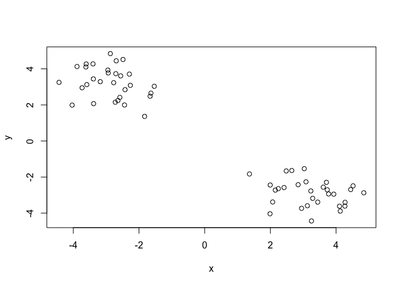
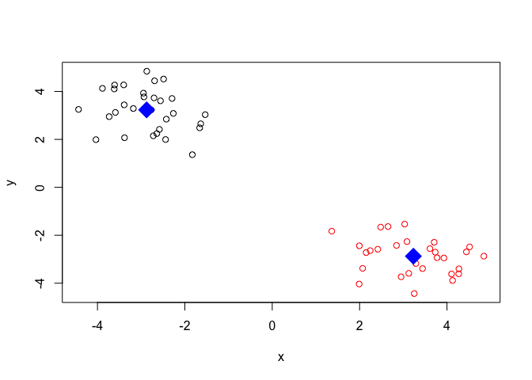
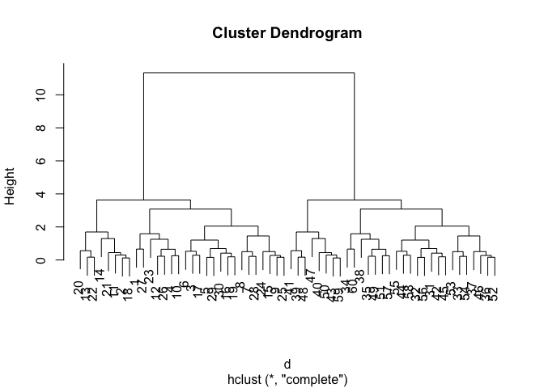
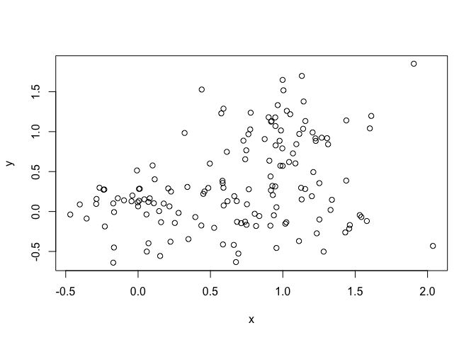
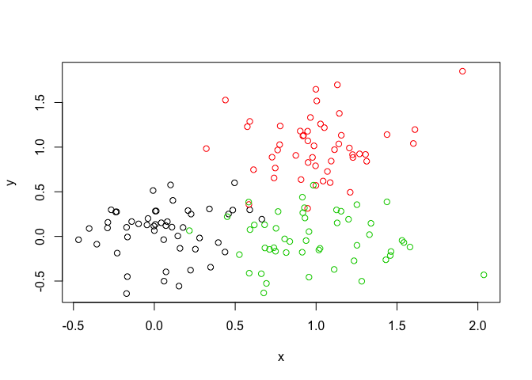
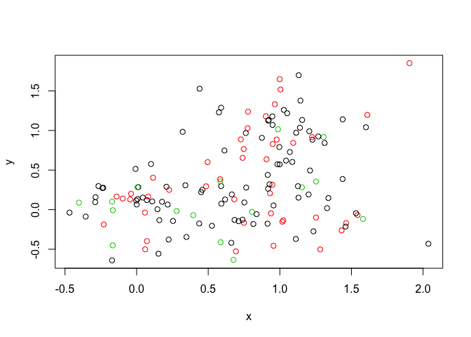
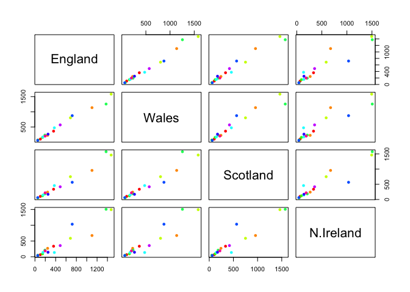
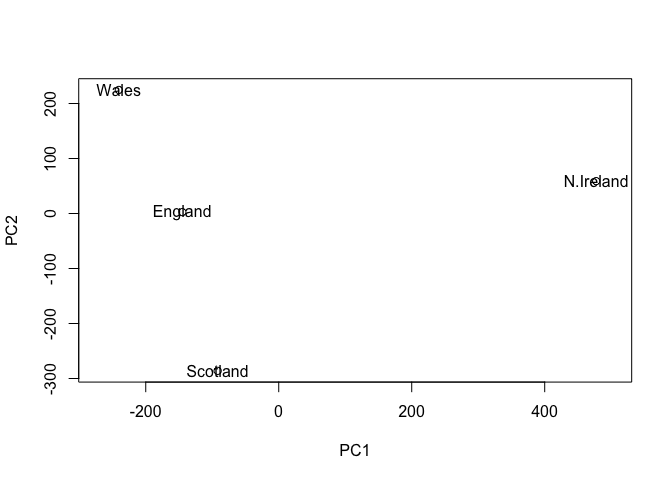

class8: Machine learning
================
Negin Silani
4/25/2019

## K-means clustering

Let’s start with an example of running the **kmeans()** function

``` r
# Generate some example data for clustering
tmp <- c(rnorm(30,-3), rnorm(30,3))
x <- cbind(x=tmp, y=rev(tmp))

plot(x)
```

<!-- -->

To Do: - Use the kmeans() function setting k to 2 and nstarty=20 -
Inspect/print the results

``` r
km<- kmeans(x, centers = 2, nstart = 20)
km
```

    ## K-means clustering with 2 clusters of sizes 30, 30
    ## 
    ## Cluster means:
    ##           x         y
    ## 1 -2.874813  3.231395
    ## 2  3.231395 -2.874813
    ## 
    ## Clustering vector:
    ##  [1] 1 1 1 1 1 1 1 1 1 1 1 1 1 1 1 1 1 1 1 1 1 1 1 1 1 1 1 1 1 1 2 2 2 2 2
    ## [36] 2 2 2 2 2 2 2 2 2 2 2 2 2 2 2 2 2 2 2 2 2 2 2 2 2
    ## 
    ## Within cluster sum of squares by cluster:
    ## [1] 38.34945 38.34945
    ##  (between_SS / total_SS =  93.6 %)
    ## 
    ## Available components:
    ## 
    ## [1] "cluster"      "centers"      "totss"        "withinss"    
    ## [5] "tot.withinss" "betweenss"    "size"         "iter"        
    ## [9] "ifault"

> Q. How many points are in each cluster? 30

``` r
km$size
```

    ## [1] 30 30

> Q. What ‘component’ of your result object details - cluster size? -
> cluster assignment/membership? - cluster
    center?

``` r
km$cluster
```

    ##  [1] 1 1 1 1 1 1 1 1 1 1 1 1 1 1 1 1 1 1 1 1 1 1 1 1 1 1 1 1 1 1 2 2 2 2 2
    ## [36] 2 2 2 2 2 2 2 2 2 2 2 2 2 2 2 2 2 2 2 2 2 2 2 2 2

``` r
km$centers
```

    ##           x         y
    ## 1 -2.874813  3.231395
    ## 2  3.231395 -2.874813

> Plot x colored by the kmeans cluster assignment and add cluster
> centers as blue points

``` r
plot(x, col= km$cluster)
points(km$centers,pch=18, col="blue", cex=3)
```

<!-- -->

## Hierarchical Clustering example

We must give the **hclust()** function a distance matrix no the raw data
as input

``` r
#distance matrix calculation
d <- dist(x)

#clustering
hc <- hclust(d)
plot(hc)
```

<!-- -->

``` r
# Draws a dendrogram

hc<- hclust(dist(x))
plot(hc)
abline(h=2, col="red")
abline(h=2.8, col="blue")
```

<!-- -->

``` r
# Cut by height h
 cutree(hc, h=6)
```

    ##  [1] 1 1 1 1 1 1 1 1 1 1 1 1 1 1 1 1 1 1 1 1 1 1 1 1 1 1 1 1 1 1 2 2 2 2 2
    ## [36] 2 2 2 2 2 2 2 2 2 2 2 2 2 2 2 2 2 2 2 2 2 2 2 2 2

``` r
cutree(hc, k=3)
```

    ##  [1] 1 1 1 1 1 1 1 1 1 1 1 1 1 1 1 1 1 1 1 1 1 1 1 1 1 1 1 1 1 1 2 2 2 2 2
    ## [36] 2 2 2 3 3 3 2 3 2 2 2 3 3 2 3 2 2 2 2 2 2 2 2 3 2

Another example but more real life with overlapping data

``` r
# Step 1. Generate some example data for clustering
x <- rbind(
 matrix(rnorm(100, mean=0, sd = 0.3), ncol = 2), # c1
 matrix(rnorm(100, mean = 1, sd = 0.3), ncol = 2), # c2
 matrix(c(rnorm(50, mean = 1, sd = 0.3), # c3
 rnorm(50, mean = 0, sd = 0.3)), ncol = 2))
colnames(x) <- c("x", "y")
# Step 2. Plot the data without clustering
plot(x)
```

<!-- -->

``` r
# Step 3. Generate colors for known clusters
# (just so we can compare to hclust results)
col <- as.factor( rep(c("c1","c2","c3"), each=50) )
plot(x, col=col)
```

<!-- -->

> Q. Use the dist(), hclust(), plot() and cutree() functions to return 2
> and 3 clusters Q. How does this compare to your known ‘col’ groups?

``` r
gp2 <- cutree(hc, k=2)
gp3 <- cutree(hc, k=3)
```

``` r
gp2
```

    ##  [1] 1 1 1 1 1 1 1 1 1 1 1 1 1 1 1 1 1 1 1 1 1 1 1 1 1 1 1 1 1 1 2 2 2 2 2
    ## [36] 2 2 2 2 2 2 2 2 2 2 2 2 2 2 2 2 2 2 2 2 2 2 2 2 2

``` r
gp3
```

    ##  [1] 1 1 1 1 1 1 1 1 1 1 1 1 1 1 1 1 1 1 1 1 1 1 1 1 1 1 1 1 1 1 2 2 2 2 2
    ## [36] 2 2 2 3 3 3 2 3 2 2 2 3 3 2 3 2 2 2 2 2 2 2 2 3 2

``` r
plot(x, col=gp3)
```

<!-- -->

``` r
table(gp2)
```

    ## gp2
    ##  1  2 
    ## 30 30

``` r
table(gp3)
```

    ## gp3
    ##  1  2  3 
    ## 30 22  8

``` r
table(gp2, gp3)
```

    ##    gp3
    ## gp2  1  2  3
    ##   1 30  0  0
    ##   2  0 22  8

# PCA: Principal Component Analysis

We will use the **prcamp()** function for PCA

``` r
# Example Data
## You can also download this file from the class website!
mydata<- read.csv("https://tinyurl.com/expression-CSV",
 row.names=1)

head(mydata, 10) 
```

    ##         wt1 wt2  wt3  wt4 wt5 ko1 ko2 ko3 ko4 ko5
    ## gene1   439 458  408  429 420  90  88  86  90  93
    ## gene2   219 200  204  210 187 427 423 434 433 426
    ## gene3  1006 989 1030 1017 973 252 237 238 226 210
    ## gene4   783 792  829  856 760 849 856 835 885 894
    ## gene5   181 249  204  244 225 277 305 272 270 279
    ## gene6   460 502  491  491 493 612 594 577 618 638
    ## gene7    27  30   37   29  34 304 304 285 311 285
    ## gene8   175 182  184  166 180 255 291 305 271 269
    ## gene9   658 669  653  633 657 628 627 603 635 620
    ## gene10  121 116  134  117 133 931 941 990 982 934

``` r
nrow(mydata)
```

    ## [1] 100

``` r
ncol(mydata)
```

    ## [1] 10

``` r
colnames(mydata)
```

    ##  [1] "wt1" "wt2" "wt3" "wt4" "wt5" "ko1" "ko2" "ko3" "ko4" "ko5"

Run our PCA analysis on the transpose of our data

``` r
pca <- prcomp( t(mydata), scale= TRUE)
```

PCA plot

``` r
## A basic PC1 vs PC2 2-D plot
plot(pca$x[,1], pca$x[,2], xlab="PC1", ylab="PC2")
```

<!-- -->

calculate the percent varance captures in each PC

``` r
## Precent variance is often more informative to look at
pca.var <- pca$sdev^2
pca.var.per <- round(pca.var/sum(pca.var)*100, 1) 

head(pca.var.per)
```

    ## [1] 92.6  2.3  1.1  1.1  0.8  0.7

``` r
barplot(pca.var.per, main="Scree Plot",
 xlab="Principal Component", ylab="Percent Variation")
```

<!-- -->

``` r
## A vector of colors for wt and ko samples
colvec <- colnames(mydata)
colvec[grep("wt", colvec)] <- "red"
colvec[grep("ko", colvec)] <- "blue"
plot(pca$x[,1], pca$x[,2], col=colvec, pch=16,
 xlab=paste0("PC1 (", pca.var.per[1], "%)"),
 ylab=paste0("PC2 (", pca.var.per[2], "%)"))
```

<!-- -->

\#\#perfrom PCA of UK food
    data

``` r
list.files()
```

    ## [1] "class08_files" "class08.Rmd"   "class08.Rproj" "UK_foods.csv"

``` r
x <- read.csv("UK_foods.csv", row.names= 1)
head(x)
```

    ##                England Wales Scotland N.Ireland
    ## Cheese             105   103      103        66
    ## Carcass_meat       245   227      242       267
    ## Other_meat         685   803      750       586
    ## Fish               147   160      122        93
    ## Fats_and_oils      193   235      184       209
    ## Sugars             156   175      147       139

``` r
dim(x)
```

    ## [1] 17  4

``` r
nrow(x)
```

    ## [1] 17

``` r
ncol(x)
```

    ## [1] 4

``` r
# Note how the minus indexing works
rownames(x) <- x[,1]
x <- x[,-1]
head(x)
```

    ##     Wales Scotland N.Ireland
    ## 105   103      103        66
    ## 245   227      242       267
    ## 685   803      750       586
    ## 147   160      122        93
    ## 193   235      184       209
    ## 156   175      147       139

``` r
dim(x)
```

    ## [1] 17  3

``` r
x <- read.csv("UK_foods.csv", row.names=1)
head(x)
```

    ##                England Wales Scotland N.Ireland
    ## Cheese             105   103      103        66
    ## Carcass_meat       245   227      242       267
    ## Other_meat         685   803      750       586
    ## Fish               147   160      122        93
    ## Fats_and_oils      193   235      184       209
    ## Sugars             156   175      147       139

``` r
barplot(as.matrix(x), beside=T, col=rainbow(nrow(x)))
```

<!-- -->

``` r
barplot(as.matrix(x), beside=F, col=rainbow(nrow(x)))
```

<!-- -->

Pairs plot can be helpful for small databases like this one but quickly
become untractable with larger datasets with too many points overlapping
etc..

``` r
pairs(x, col=rainbow(10), pch=16)
```

<!-- -->

\#\#\#PCA to the rescue

Let’s try PCA on this dataset with the **prcomp()** function

``` r
pca <- prcomp( t(x) )
summary(pca)
```

    ## Importance of components:
    ##                             PC1      PC2      PC3       PC4
    ## Standard deviation     324.1502 212.7478 73.87622 4.189e-14
    ## Proportion of Variance   0.6744   0.2905  0.03503 0.000e+00
    ## Cumulative Proportion    0.6744   0.9650  1.00000 1.000e+00

``` r
# Plot PC1 vs PC2

plot(pca$x[,1], pca$x[,2], xlab="PC1", ylab="PC2", xlim=c(-270,500))
text(pca$x[,1], pca$x[,2], colnames(x))
```

<!-- -->

``` r
mycols<- c("orange","red","blue","darkgreen")

plot(pca$x[,1], pca$x[,2], xlab="PC1", ylab="PC2", xlim=c(-270,500))
text(pca$x[,1], pca$x[,2], colnames(x), col=mycols)
```

<!-- -->

\#\#Digging

``` r
## Lets focus on PC1 as it accounts for > 90% of variance 
par(mar=c(10, 3, 0.35, 0))
barplot( pca$rotation[,1], las=2 )
```

<!-- -->
