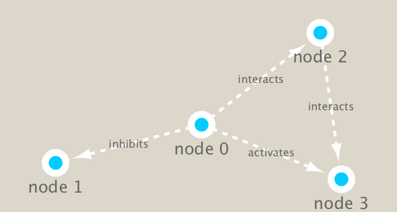

```{r setup, include=FALSE}
knitr::opts_chunk$set(echo = TRUE)
```

##Set up Cytoscape and R connection

We will use the **RCy3** and **igraph** packages in this class.
The first is from bioconductor the second from CRAN

```{r}
install.packages("igraph")
```


```{r}
library(RCy3)
library(igraph)
library(RColorBrewer)
```

```{r}
#Test the connection to Cytoscape
cytoscapePing()
```


```{r}
g <- makeSimpleIgraph()
createNetworkFromIgraph(g,"myGraph")

```

change the network display in cytoscape

```{r}
setVisualStyle("Marquee")
```

```{r}
fig <- exportImage(filename="demo_marquee", type="png", height=350)


```

```{r}
g
```

```{r}
plot(g)
```

# Read our metagenomics data

```{r}
prok_vir_cor <- read.delim("virus_prok_cor_abundant.tsv", stringsAsFactors = FALSE)

## Have a peak at the first 6 rows
head(prok_vir_cor)
```

```{r}
g <- graph.data.frame(prok_vir_cor, directed = FALSE)

```

Using the igraph function **graph.data.frame()** to make a network graph

```{r}
plot(g)
```

Turn the node (vertex) labels off in this plot

```{r}
plot(g, vertex.label=NA)
```

Make the vertex much smaller

```{r}
plot(g, vertex.size=3, vertex.label=NA)
```

```{r}
library(ggraph)
```

```{r}
ggraph(g, layout = 'auto') +
  geom_edge_link(alpha = 0.25) +
  geom_node_point(color="steelblue") +
  theme_graph()
```

```{r}
createNetworkFromIgraph(g,"myIgraph")
```

```{r}
V(g)
```

```{r}
E(g)
```

```{r}
cb <- cluster_edge_betweenness(g)
```

```{r}
cb
```

```{r}
plot(cb, y=g, vertex.label=NA,  vertex.size=3)
```

```{r}
head( membership(cb) )
```

```{r}
# Calculate and plot node degree of our network
d <- degree(g)
hist(d, breaks=30, col="lightblue", main ="Node Degree Distribution")
```

```{r}
plot( degree_distribution(g), type="h" )
```


```{r}
pr <- page_rank(g)
head(pr$vector)
```

```{r}
# Make a size vector btwn 2 and 20 for node plotting size

v.size <- BBmisc::normalize(pr$vector, range=c(2,20), method="range")
plot(g, vertex.size=v.size, vertex.label=NA)
```

```{r}
phage_id_affiliation <- read.delim("phage_ids_with_affiliation.tsv")
head(phage_id_affiliation)
```

